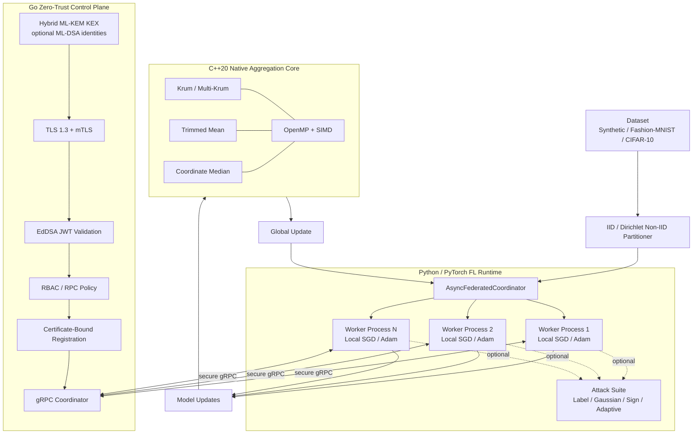

# ZeroTrust-FL-Sim

<p align="center">
  <strong>Zero-Trust Federated Learning Simulation with Byzantine-Robust Native Aggregation and Post-Quantum Transport</strong>
</p>

<p align="center">
  A reproducible research platform for secure federated learning under non-IID data, asynchronous execution, malicious clients, Byzantine model poisoning, zero-trust network controls, and hybrid post-quantum TLS.
</p>

<p align="center">
  
  
  
  
  
  
  
  <a href="https://github.com/smshagor-dev/ZeroTrust-FL-Sim/actions/workflows/ci.yml">
    
  </a>
</p>

---

## Overview

**ZeroTrust-FL-Sim** is a software-only federated learning platform for evaluating the interaction between learning robustness, Byzantine fault tolerance, and zero-trust distributed-systems controls.

The repository combines:

- deterministic IID and Dirichlet non-IID data partitioning;
- asynchronous multi-process PyTorch workers;
- local SGD and Adam training;
- configurable straggler and network-delay simulation;
- label-flipping, Gaussian, sign-flipping, and adaptive poisoning attacks;
- native C++20 Krum, Multi-Krum, trimmed-mean, and coordinate-wise median aggregation;
- OpenMP/SIMD acceleration through `pybind11`;
- TLS 1.3 mutual authentication;
- hybrid ML-KEM key exchange with explicit `off`, `prefer`, and `require` policies;
- optional ML-DSA-65 CA/server/client identities for strict post-quantum mTLS experiments;
- certificate-bound JWT identities and role-based gRPC authorization;
- Docker Compose orchestration for benign and malicious workers;
- cross-language verification and automated benchmark generation.

The project is intended for research and engineering work in federated learning, trustworthy AI, Byzantine fault tolerance, adversarial machine learning, secure distributed systems, and post-quantum zero-trust architectures.

> **Scope:** robust aggregation and post-quantum transport address different threat classes. Neither provides a universal defense against arbitrary backdoors, compromised endpoints, poisoned data pipelines, stolen private keys, compromised coordinators, or violations of the stated Byzantine/PQC assumptions.

---

## System Architecture



The local multiprocessing simulation and the Go network-security control plane are deliberately separable. This permits independent measurement of learning robustness, Byzantine mitigation, transport overhead, and zero-trust authorization behavior.

---

# Mathematical Foundations

> GitHub math note: inline equations use `$...$`; display equations use fenced `math` blocks. This avoids unsupported or inconsistently rendered GitHub README macros and delimiters.

## Federated Learning Objective

Let there be $K$ federated clients. Client $k$ owns local dataset:

```math
\mathcal{D}_k = \{(x_{k,i}, y_{k,i})\}_{i=1}^{N_k}.
```

For model parameters $W \in \mathbb{R}^{d}$, client $k$ minimizes:

```math
F_k(W)
=
\frac{1}{N_k}
\sum_{i=1}^{N_k}
\ell(W; x_{k,i}, y_{k,i}).
```

Here, $\ell$ is the task loss and $N_k$ is the number of local samples owned by client $k$.

A conventional weighted global objective is:

```math
F(W)
=
\sum_{k=1}^{K} q_k F_k(W),
\qquad
q_k \ge 0,
\qquad
\sum_{k=1}^{K} q_k = 1.
```

At federated round $t$, worker $k$ receives $W^{(t)}$, performs local optimization, and obtains $W_k^{(t)}$. Its model delta is:

```math
\Delta_k^{(t)} = W_k^{(t)} - W^{(t)}.
```

The server applies aggregation operator $\mathcal{A}$:

```math
\widehat{\Delta}^{(t)}
=
\mathcal{A}
\left(
\Delta_1^{(t)},
\ldots,
\Delta_n^{(t)}
\right).
```

The global model is then updated as:

```math
W^{(t+1)}
=
W^{(t)} + \widehat{\Delta}^{(t)}.
```

For ordinary arithmetic averaging:

```math
\mathcal{A}_{\mathrm{mean}}
=
\frac{1}{n}
\sum_{i=1}^{n}
\Delta_i.
```

A Byzantine worker is not required to obey this local-learning rule and may submit an arbitrary manipulated update instead.

---

## Data Heterogeneity and Non-IID Partitioning

For each class $c$, ZeroTrust-FL-Sim samples a client-proportion vector from a symmetric $K$-dimensional Dirichlet distribution:

```math
\mathbf{p}^{(c)}
\sim
\mathrm{Dir}_K
\left(
\alpha \mathbf{1}_K
\right).
```

Compactly:

```math
p_k \sim \mathrm{Dir}_K(\alpha).
```

More explicitly:

```math
\mathbf{p}^{(c)}
=
\left(
p_1^{(c)},
\ldots,
p_K^{(c)}
\right),
\qquad
p_k^{(c)} \ge 0,
\qquad
\sum_{k=1}^{K} p_k^{(c)} = 1.
```

The concentration parameter $\alpha>0$ controls heterogeneity:

- **small $\alpha$**: sparse class allocation and strong client drift;
- **$\alpha \approx 1$**: moderate heterogeneity;
- **large $\alpha$**: proportions concentrate near $1/K$, approaching IID-like allocation.

For a symmetric Dirichlet distribution:

```math
\mathbb{E}\left[p_k^{(c)}\right]
=
\frac{1}{K}.
```

The implementation allocates every source sample exactly once, performs deterministic seeded retries, and can enforce a minimum number of samples per client.

---

# Adversarial Threat Formulation

Let $\mathcal{B}$ be the compromised-client set and $f=|\mathcal{B}|$ the assumed Byzantine count.

## Label-Flipping Attack

Define an attacker-selected target mapping:

```math
f_{\mathrm{label}} : \mathcal{Y} \rightarrow \mathcal{Y}.
```

A poisoned label is:

```math
\widetilde{y}
=
f_{\mathrm{label}}(y)
=
y'.
```

For targeted flipping from class $a$ to class $b$:

```math
f_{\mathrm{label}}(y)
=
\begin{cases}
b, & y=a, \\
y, & y\neq a.
\end{cases}
```

## Additive Gaussian Noise Poisoning

For malicious worker $i$:

```math
\widetilde{W}_i
=
W_i + \varepsilon_i,
```

where:

```math
\varepsilon_i
\sim
\mathcal{N}
\left(
\mu \mathbf{1},
\sigma^2 \mathbf{I}_d
\right).
```

For the zero-mean case:

```math
\widetilde{W}_i
=
W_i
+
\mathcal{N}
\left(
0,
\sigma^2 \mathbf{I}_d
\right).
```

## Sign-Flipping Attack

For honest gradient or model delta $g_i$:

```math
\widetilde{g}_i
=
-\gamma g_i,
\qquad
\gamma \ge 0.
```

## Adaptive Norm-Constrained Poisoning

First form:

```math
g_i^{\star}
=
-s g_i,
\qquad
s \ge 0.
```

Let:

```math
r_{\max}
=
\rho \lVert g_i \rVert_2,
\qquad
\rho > 0.
```

Then submit:

```math
\widetilde{g}_i
=
\begin{cases}
g_i^{\star}, & \lVert g_i^{\star}\rVert_2 \le r_{\max}, \\
\displaystyle
r_{\max}
\frac{g_i^{\star}}{\lVert g_i^{\star}\rVert_2},
& \lVert g_i^{\star}\rVert_2 > r_{\max}.
\end{cases}
```

---

# C++20 Byzantine-Robust Aggregation

The native module is `zerotrust_fl_cpp`, exposed to PyTorch through `zerotrust_fl.aggregators.CppByzantineAggregator`.

All updates must have identical shape and finite values. Native input is contiguous `float32`; Krum distance and aggregation accumulations use `double` where appropriate.

## Krum and Multi-Krum

Let:

```math
W_1,
W_2,
\ldots,
W_n
\in
\mathbb{R}^{d}.
```

The pairwise squared Euclidean distance is:

```math
D_{ij}
=
\lVert W_i-W_j\rVert_2^2
=
\sum_{r=1}^{d}
\left(w_{i,r}-w_{j,r}\right)^2.
```

For client $i$, let $\mathcal{N}_i$ contain its $n-f-2$ nearest peers. The Krum score is:

```math
S_i
=
\sum_{j\in\mathcal{N}_i}
\lVert W_i-W_j\rVert_2^2.
```

The implementation requires:

```math
n \ge 2f+3.
```

Classic Krum selects:

```math
i^{\star}
=
\arg\min_i S_i,
```

and returns:

```math
\mathcal{A}_{\mathrm{Krum}}
=
W_{i^{\star}}.
```

For Multi-Krum, let $\mathcal{M}_m$ contain the $m$ smallest-score indices, with:

```math
1 \le m \le n-f-2.
```

Then:

```math
\mathcal{A}_{\mathrm{MultiKrum}}
=
\frac{1}{m}
\sum_{i\in\mathcal{M}_m}
W_i.
```

## Adaptive Trimmed Mean

For coordinate $j$, sort:

```math
w_j^{(1)}
\le
w_j^{(2)}
\le
\cdots
\le
w_j^{(n)}.
```

A common canonical definition uses:

```math
b
=
\lceil \beta n \rceil
```

and:

```math
\bar{w}_j
=
\frac{1}{n-2\lceil\beta n\rceil}
\sum_{i=\lceil\beta n\rceil+1}^{n-\lceil\beta n\rceil}
w_j^{(i)}.
```

### Exact repository operator

The C++ implementation uses:

```math
b_{\mathrm{impl}}
=
\lfloor \beta n \rfloor.
```

It computes:

```math
\bar{w}_{j,\mathrm{impl}}
=
\frac{1}{n-2b_{\mathrm{impl}}}
\sum_{i=b_{\mathrm{impl}}+1}^{n-b_{\mathrm{impl}}}
w_j^{(i)},
```

subject to:

```math
2b_{\mathrm{impl}} < n.
```

## Coordinate-Wise Median

For ordered values $w_j^{(1)}\le\cdots\le w_j^{(n)}$, odd $n$ uses:

```math
\widehat{w}_j
=
w_j^{((n+1)/2)}.
```

Even $n$ uses:

```math
\widehat{w}_j
=
\frac{1}{2}
\left(
w_j^{(n/2)}
+
w_j^{(n/2+1)}
\right).
```

The aggregate is:

```math
\mathcal{A}_{\mathrm{median}}
=
\left(
\widehat{w}_1,
\ldots,
\widehat{w}_d
\right).
```

This is coordinate-wise median, not a geometric/spatial median.

---

# Computational Complexity

Let $n$ be client count, $d$ model dimension, $m$ Multi-Krum candidate count, and $P$ effective CPU threads.

## Krum / Multi-Krum

There are:

```math
\binom{n}{2}
=
\frac{n(n-1)}{2}
```

pairwise distances. Each scans $d$ coordinates, giving:

```math
T_{\mathrm{Krum}}
=
O(n^2d).
```

For Multi-Krum:

```math
T_{\mathrm{MultiKrum}}
=
O(n^2d+md)
=
O(n^2d)
```

for typical $m\le n$.

The explicit distance matrix adds:

```math
S_{\mathrm{Krum}}
=
O(n^2)
```

scalar storage beyond the input updates.

## Trimmed Mean

Coordinate sorting gives:

```math
T_{\mathrm{trim}}
=
O(dn\log n).
```

## Coordinate Median

`std::nth_element` gives average selection work approximately:

```math
T_{\mathrm{median}}
\approx
O(dn).
```

## Parallel Native Execution

Idealized Krum scaling with $P$ OpenMP workers is:

```math
\mathcal{T}_{\mathrm{parallel}}
\approx
O\left(
\frac{n^2d}{P}
\right).
```

For trimmed mean:

```math
\mathcal{T}_{\mathrm{trim,parallel}}
\approx
O\left(
\frac{dn\log n}{P}
\right).
```

Amdahl's law gives:

```math
S(P)
=
\frac{1}{(1-\phi)+\phi/P},
```

where $\phi$ is the parallelizable fraction.

| Algorithm | Serial time | Idealized parallel time | Extra algorithmic space |
| --- | ---: | ---: | ---: |
| Krum | $O(n^2d)$ | $O(n^2d/P)$ | $O(n^2)$ |
| Multi-Krum | $O(n^2d+md)$ | approximately $O((n^2d+md)/P)$ | $O(n^2)$ |
| Trimmed mean | $O(dn\log n)$ | $O(dn\log n/P)$ | $O(Pn+d)$ scratch/result |
| Coordinate median | expected $O(dn)$ | approximately $O(dn/P)$ | $O(Pn+d)$ scratch/result |

---

# Zero-Trust Security Model

Network reachability is never treated as sufficient evidence of federation membership or authorization.

For protected coordinator RPCs:

1. TLS 1.3 handshake succeeds.
2. The selected PQC policy is enforced.
3. The client certificate chains to the configured CA.
4. If strict PQC identity mode is enabled, the peer leaf certificate must use ML-DSA.
5. Certificate CN, role OU, and URI SAN are internally consistent.
6. Exactly one bearer JWT is present.
7. The JWT passes signature, issuer, audience, and expiry validation.
8. JWT `sub`, `node_id`, and `role` match the authenticated certificate identity.
9. The role is permitted to invoke the requested RPC.
10. RPCs requiring membership verify live server-side registration.
11. Registration is bound to the client certificate fingerprint.

Example identity:

```text
Subject CN: edge-worker-01
Subject OU: role:edge-worker
URI SAN:    spiffe://zerotrust-fl.local/node/edge-worker-01
```

## RPC Policy

| RPC | Allowed roles | Registration required |
| --- | --- | --- |
| `RegisterNode` | `edge-worker`, `observer`, `admin` | No |
| `Heartbeat` | `edge-worker`, `observer`, `admin` | Yes |
| `GetGlobalModel` | `edge-worker`, `observer`, `admin` | Yes |
| `SubmitLocalUpdate` | `edge-worker`, `admin` | Yes |
| gRPC health check | configured health identity | No |

Unknown methods are denied.

---

# Post-Quantum Cryptography in the Transport Layer

## Initial Security Motivation

TLS 1.3 itself remains a modern transport protocol, but a TLS deployment that relies only on classical elliptic-curve key exchange does not address the long-term **harvest-now-decrypt-later** threat from a future cryptographically relevant quantum computer.

ZeroTrust-FL-Sim therefore adds explicit hybrid post-quantum key-exchange policy using Go 1.27's standardized ML-KEM support.

Go 1.27 provides:

- `X25519MLKEM768`;
- `SecP256r1MLKEM768`;
- `SecP384r1MLKEM1024`;
- `MLKEM1024` support;
- ML-DSA X.509/TLS signature support through `crypto/mldsa` and `crypto/x509`.

The live coordinator transport uses Go's maintained `crypto/tls` implementation. Open Quantum Safe `liboqs-go` remains useful for experimental algorithms, independent KEM/signature testing, and cross-implementation validation, but it is not inserted into the live TLS state machine because Go 1.27 already implements the standardized TLS groups directly.

This avoids:

- a second TLS implementation;
- mandatory CGo/pkg-config/liboqs runtime dependencies;
- custom non-standard pre-handshake KEM protocols;
- additional production attack surface.

See [`docs/pqc-transport.md`](docs/pqc-transport.md) for the detailed rationale and transport model.

## Hybrid Shared Secret

For `X25519MLKEM768`, the conceptual pre-KDF secret is the concatenation of the ML-KEM and X25519 contributions:

```math
Z_{\mathrm{hybrid}}
=
Z_{\mathrm{MLKEM768}}
\parallel
Z_{\mathrm{X25519}}.
```

Each contribution is 32 bytes, therefore:

```math
|Z_{\mathrm{hybrid}}|
=
32 + 32
=
64\ \mathrm{bytes}.
```

TLS 1.3 feeds the negotiated secret into its normal HKDF-based key schedule.

## PQC Transport Modes

The coordinator exposes `ZTFL_PQC_MODE` / `--pqc-mode`:

| Mode | Hybrid ML-KEM | Classical fallback | Use case |
| --- | --- | --- | --- |
| `off` | disabled | yes | classical control/baseline |
| `prefer` | enabled | yes | default heterogeneous deployment |
| `require` | required | no | strict PQC Go-to-Go experiment |

`require` is enforced twice:

- classical-only groups are removed from `tls.Config.CurvePreferences`;
- `VerifyConnection` rejects a completed connection unless the negotiated `CurveID` contains an ML-KEM contribution.

This prevents a deployment from being labeled PQC-required while silently falling back to classical-only key exchange.

## ML-DSA Identity Mode

Hybrid ML-KEM protects key establishment. Post-quantum authentication requires the certificate-signature side to migrate as well.

Generate an ML-DSA-65 development PKI:

```bash
go run ./security \
  -out certs/pqc \
  -certificate-algorithm mldsa65
```

Run the coordinator with strict hybrid key exchange and strict ML-DSA identities:

```bash
go run ./cmd/coordinator \
  -server-cert certs/pqc/server.crt \
  -server-key certs/pqc/server.key \
  -client-ca certs/pqc/ca.crt \
  -jwt-public-key certs/pqc/jwt_signing_public.pem \
  -pqc-mode require \
  -pqc-require-identity
```

The Go client must set:

```go
PQCMode:            security.PQCRequired,
RequirePQCIdentity: true,
```

Strict identity mode rejects a locally configured certificate that is not ML-DSA and rejects a peer whose verified leaf certificate is not ML-DSA.

The JWT layer currently remains Ed25519. It is a secondary application-authorization factor and cannot bypass strict ML-DSA mTLS identity enforcement.

## Exact X25519MLKEM768 Wire-Size Calculation

Classical X25519 contributes a 32-byte raw key share in each direction.

For `X25519MLKEM768`:

- client key share: **1216 bytes** = 1184-byte ML-KEM-768 encapsulation key + 32-byte X25519 share;
- server key share: **1120 bytes** = 1088-byte ML-KEM-768 ciphertext + 32-byte X25519 share.

Client-side expansion:

```math
\Delta B_{\mathrm{client}}
=
1216 - 32
=
1184\ \mathrm{bytes}.
```

Client raw-share multiplier:

```math
R_{\mathrm{client}}
=
\frac{1216}{32}
=
38.
```

Server-side expansion:

```math
\Delta B_{\mathrm{server}}
=
1120 - 32
=
1088\ \mathrm{bytes}.
```

Server raw-share multiplier:

```math
R_{\mathrm{server}}
=
\frac{1120}{32}
=
35.
```

Combined classical raw key shares:

```math
B_{\mathrm{classical}}
=
32 + 32
=
64\ \mathrm{bytes}.
```

Combined hybrid raw key shares:

```math
B_{\mathrm{hybrid}}
=
1216 + 1120
=
2336\ \mathrm{bytes}.
```

Absolute increase:

```math
\Delta B_{\mathrm{hybrid}}
=
2336 - 64
=
2272\ \mathrm{bytes}.
```

Combined multiplier:

```math
R_{\mathrm{combined}}
=
\frac{2336}{64}
=
36.5.
```

These values describe only the raw TLS key-exchange payloads. They exclude TLS framing, X.509 chains, ML-DSA signatures, TCP/IP, HTTP/2, gRPC, and FL application data.

## PQC Handshake Latency Calculation

For measured classical handshake latency $T_{\mathrm{classical}}$ and hybrid latency $T_{\mathrm{PQC}}$:

```math
\Delta T_{\mathrm{PQC}}
=
T_{\mathrm{PQC}}
-
T_{\mathrm{classical}}.
```

Percentage overhead is:

```math
O_{\mathrm{PQC}}
=
100
\left(
\frac{T_{\mathrm{PQC}}}{T_{\mathrm{classical}}}
-1
\right)\%.
```

A benchmark result must record CPU, Go version, selected group, session reuse, network RTT, certificate algorithm, and PQC identity mode because there is no hardware-independent universal latency penalty.

## Docker Compatibility

The mixed Go/Python Compose testbed defaults to:

```text
ZTFL_PQC_MODE=prefer
ZTFL_PQC_REQUIRE_IDENTITY=false
ZTFL_CERTIFICATE_ALGORITHM=ed25519
```

This preserves compatibility with the existing Python gRPC workers while allowing hybrid negotiation with compatible peers.

Strict ML-DSA Compose mode should only be enabled after confirming that the selected Python `grpcio`/BoringSSL build can parse and authenticate ML-DSA certificate chains.

---

# Asynchronous FL Engine

The PyTorch runtime uses persistent multiprocessing workers. Each simulated node owns its dataset shard, local model, optimizer configuration, optional attack configuration, deterministic seed, and latency configuration.

The coordinator provides:

- asynchronous round dispatch and collection;
- client sampling;
- minimum-result quorum;
- simulated compute/network latency;
- stale-result handling;
- worker-death detection;
- native or Torch aggregation selection;
- global loss/accuracy evaluation;
- attack-mitigation metrics.

Supported aggregation methods:

```text
mean
krum
multi_krum
trimmed_mean
median
```

Supported attack modes:

```text
none
label_flip
gaussian
sign_flip
adaptive
```

---

# Repository Structure

```text
ZeroTrust-FL-Sim/
├── .github/workflows/
│   └── ci.yml
├── benchmarks/
│   └── benchmark_suite.py
├── cmd/
│   └── coordinator/
├── cpp/
│   ├── include/
│   └── src/
├── docker/
│   ├── Dockerfile.coordinator
│   └── Dockerfile.worker
├── docker-compose.yml
├── docs/
│   ├── fl-simulation.md
│   ├── native-aggregation.md
│   ├── pqc-transport.md
│   └── security-transport.md
├── fl/zerotrust_fl/
│   ├── aggregators/
│   ├── attacks/
│   ├── client/
│   ├── data/
│   ├── engine/
│   └── protocols/
├── pkg/security/
│   ├── middleware.go
│   ├── pki.go
│   ├── pqc.go
│   ├── pqc_test.go
│   ├── tls.go
│   └── token.go
├── proto/
│   └── fl_service.proto
├── scripts/
│   ├── generate_python_proto.py
│   ├── run_fl_sim.py
│   ├── run_grpc_worker.py
│   └── verify_system.sh
├── security/
│   └── certgen.go
├── tests/
│   ├── security_test.go
│   ├── test_cpp_aggregator.py
│   └── test_fl_engine.py
├── pyproject.toml
├── setup.py
└── requirements.txt
```

---

# Requirements

- Go 1.27.1 or compatible newer release
- Python 3.12+
- PyTorch 2.14.0
- C++20-compatible compiler
- CMake 3.24+
- pybind11 3.1.x
- Protocol Buffers compiler (`protoc`)
- Docker with Compose v2

Go 1.27 is specifically relevant to the strict PQC path because it provides ML-DSA support in the standard library in addition to the hybrid ML-KEM TLS groups.

---

# Quickstart

## Clone

```bash
git clone https://github.com/smshagor-dev/ZeroTrust-FL-Sim.git
cd ZeroTrust-FL-Sim
```

## Python Environment

Linux/macOS:

```bash
python3.12 -m venv .venv
source .venv/bin/activate
python -m pip install --upgrade pip setuptools wheel
pip install -r requirements.txt
```

Windows PowerShell:

```powershell
py -3.12 -m venv .venv
.\.venv\Scripts\Activate.ps1
python -m pip install --upgrade pip setuptools wheel
pip install -r requirements.txt
```

Generate Python protobuf bindings:

```bash
python scripts/generate_python_proto.py
```

Build native C++ aggregation:

```bash
pip install -e .
```

Verify:

```bash
python -c "import zerotrust_fl_cpp as native; print(native.__version__, native.openmp_enabled)"
```

---

# Native C++20 Build

```bash
ZTFL_ENABLE_OPENMP=ON ZTFL_NATIVE_ARCH=ON pip install -e .
```

Portable build:

```bash
ZTFL_NATIVE_ARCH=OFF pip install -e .
```

Direct CMake build:

```bash
cmake -S cpp -B cpp/build \
  -DCMAKE_BUILD_TYPE=Release \
  -DZTFL_ENABLE_OPENMP=ON \
  -DZTFL_NATIVE_ARCH=ON

cmake --build cpp/build --config Release --parallel
```

---

# Go Coordinator Setup

Install protobuf plugins:

```bash
go install google.golang.org/protobuf/cmd/protoc-gen-go@v1.36.12
go install google.golang.org/grpc/cmd/protoc-gen-go-grpc@v1.6.2
```

Generate Go bindings:

```bash
make proto
```

Generate interoperable development PKI:

```bash
go run ./security -out certs/dev
```

Run the coordinator with the default hybrid-preferred policy:

```bash
go run ./cmd/coordinator
```

Equivalent explicit command:

```bash
go run ./cmd/coordinator -pqc-mode prefer
```

Strict Go-only PQC setup:

```bash
go run ./security \
  -out certs/pqc \
  -certificate-algorithm mldsa65

go run ./cmd/coordinator \
  -server-cert certs/pqc/server.crt \
  -server-key certs/pqc/server.key \
  -client-ca certs/pqc/ca.crt \
  -jwt-public-key certs/pqc/jwt_signing_public.pem \
  -pqc-mode require \
  -pqc-require-identity
```

Default listener:

```text
127.0.0.1:50051
```

---

# Running Federated Simulations

Multi-Krum with sign-flipping workers:

```bash
python scripts/run_fl_sim.py \
  --dataset synthetic \
  --clients 10 \
  --rounds 5 \
  --partition dirichlet \
  --alpha 0.3 \
  --malicious-fraction 0.2 \
  --attack sign_flip \
  --aggregator multi_krum \
  --byzantine-f 2 \
  --multi-krum-k 3 \
  --backend native
```

Trimmed mean with Gaussian poisoning:

```bash
python scripts/run_fl_sim.py \
  --dataset synthetic \
  --clients 10 \
  --rounds 10 \
  --partition dirichlet \
  --alpha 0.2 \
  --malicious-fraction 0.2 \
  --attack gaussian \
  --aggregator trimmed_mean \
  --trim-beta 0.2 \
  --backend native
```

---

# Docker Zero-Trust Testbed

Start the interoperable testbed:

```bash
mkdir -p benchmarks/results
docker compose build
docker compose up -d --wait
```

Inspect:

```bash
docker compose ps
docker compose logs -f
```

Select malicious attack:

```bash
ZTFL_MALICIOUS_ATTACK=label_flip docker compose up -d --build --wait
```

Stop:

```bash
docker compose down -v --remove-orphans
```

PQC-related Compose variables:

```text
ZTFL_PQC_MODE
ZTFL_PQC_REQUIRE_IDENTITY
ZTFL_CERTIFICATE_ALGORITHM
```

Default values remain `prefer`, `false`, and `ed25519` respectively for Python-worker compatibility.

---

# Performance Benchmarks

`benchmarks/benchmark_suite.py` includes aggregation, transport, and convergence benchmarks.

Full native-vs-reference aggregation dimensions:

```math
d \in \{10^3,10^5,10^7\}.
```

Run full suite:

```bash
python benchmarks/benchmark_suite.py --profile full
```

Quick CI profile:

```bash
python benchmarks/benchmark_suite.py --profile quick
```

Default outputs:

```text
benchmarks/results/
├── benchmark_metadata.json
├── aggregation.csv
├── aggregation_speedup.png
├── network.csv
├── mtls_overhead.png
├── convergence.csv
└── poisoning_convergence.png
```

Plots are exported at 300 DPI.

## Aggregation Speedup

```math
\mathrm{speedup}
=
\frac{T_{\mathrm{NumPy}}}
{T_{\mathrm{native}}}.
```

## Memory Scaling

For $n$ float32 updates of dimension $d$:

```math
M_{\mathrm{updates}}
=
4nd
\quad \mathrm{bytes}.
```

Krum's additional distance matrix is:

```math
M_{\mathrm{distance}}
=
8n^2
\quad \mathrm{bytes}.
```

## Convergence Attack Matrix

The full convergence profile uses 20 workers and exact malicious fractions:

| Byzantine fraction | Malicious workers |
| ---: | ---: |
| 0% | 0 |
| 10% | 2 |
| 25% | 5 |
| 40% | 8 |

Measured loss/accuracy values should be read from `benchmarks/results/convergence.csv`; this README does not fabricate machine-independent results.

---

# Testing and Verification

Python/C++:

```bash
pytest tests/test_cpp_aggregator.py -q
pytest tests/test_fl_engine.py -q
pytest -q
```

Go:

```bash
make proto
go fmt ./...
go vet ./...
go test -v ./...
```

Strict PQC tests:

```bash
go test -v ./pkg/security -run 'PQC|MLDSA'
```

The PQC tests verify:

- required policy contains only ML-KEM/hybrid groups;
- `off` contains classical-only groups;
- a strict ML-KEM + ML-DSA mutual TLS handshake succeeds;
- the negotiated connection state reports a PQC/hybrid group;
- both peers authenticate ML-DSA leaf certificates;
- a strict PQC server rejects a classical-only peer.

Full cross-language verification:

```bash
./scripts/verify_system.sh
```

---

# CI/CD

`.github/workflows/ci.yml` validates:

### Go

- Go 1.27.1
- protobuf generation
- formatting
- `go vet`
- all Go tests, including PQC transport tests

### Python / C++20

- Python 3.12
- GCC/G++ 12
- CMake
- native extension build
- Ruff
- pytest coverage

### Integration

- Docker Compose build
- zero-trust cluster startup
- authenticated health check
- benchmark smoke profile
- artifact upload
- container log capture

---

# Security Assumptions and Limitations

## Assumptions

- TLS trust anchors remain uncompromised.
- Worker and coordinator private keys remain secret.
- The coordinator host is trusted for the experiment.
- Strict PQC claims use `pqc-mode=require` rather than `prefer`.
- Post-quantum identity claims use ML-DSA certificates with `pqc-require-identity`.
- The selected Byzantine bound $f$ matches the aggregation configuration.

## Important distinctions

`prefer` means **PQC-capable with fallback**, not PQC-guaranteed.

`require` means classical-only key exchange is rejected.

`pqc-require-identity` means classical X.509 leaf identities are rejected.

A correctly authenticated worker may still be malicious at the ML layer; robust aggregation remains necessary.

## Not Guaranteed

The system does not automatically protect against:

- compromised coordinators;
- stolen trusted private keys;
- malicious trusted CAs;
- endpoint compromise;
- semantic backdoors inside robust-statistics acceptance regions;
- sybil identities legitimately issued by the CA;
- Byzantine populations exceeding algorithm assumptions;
- future cryptanalytic breaks in standardized PQC algorithms.

---

# Reproducibility

Record at minimum:

- Git commit SHA;
- Go version;
- Python/PyTorch versions;
- compiler and CMake versions;
- CPU/thread count;
- OpenMP state;
- dataset and Dirichlet $\alpha$;
- client and malicious counts;
- attack configuration;
- aggregation method and Byzantine bound;
- random seed;
- federated rounds;
- `ZTFL_PQC_MODE`;
- negotiated TLS `CurveID` where measured;
- certificate algorithm (`ed25519` or `mldsa65`);
- `ZTFL_PQC_REQUIRE_IDENTITY`;
- benchmark profile.

Useful metadata commands:

```bash
git rev-parse HEAD
go version
python --version
python -c "import torch; print(torch.__version__)"
cmake --version
python -c "import zerotrust_fl_cpp as native; print('OpenMP:', native.openmp_enabled)"
```

---

# Development Principles

- Deny RPC access by default.
- Treat authenticated workers as potentially malicious at the ML layer.
- Do not equate `prefer` with enforced PQC.
- Verify the negotiated TLS group when strict PQC is required.
- Keep certificate authentication and key-exchange migration separate and explicit.
- Reject non-finite model updates before native aggregation.
- Keep keys and tokens outside source control.
- Preserve deterministic seeds where practical.
- Compare optimized native algorithms against correctness references.
- Distinguish formal guarantees, implementation constraints, and empirical measurements.

---

# License

This repository currently does **not** declare a repository license. No MIT, Apache-2.0, GPL, BSD, or other license should be inferred from public source availability alone.

Add an explicit `LICENSE` file before redistributing the project under a specific open-source license.

---

# Repository

**GitHub:** https://github.com/smshagor-dev/ZeroTrust-FL-Sim

ZeroTrust-FL-Sim is designed to make the complete secure FL experiment inspectable across the stack:

**data heterogeneity → malicious local behavior → asynchronous execution → Byzantine aggregation → hybrid post-quantum mTLS → zero-trust authorization → reproducible verification**.
