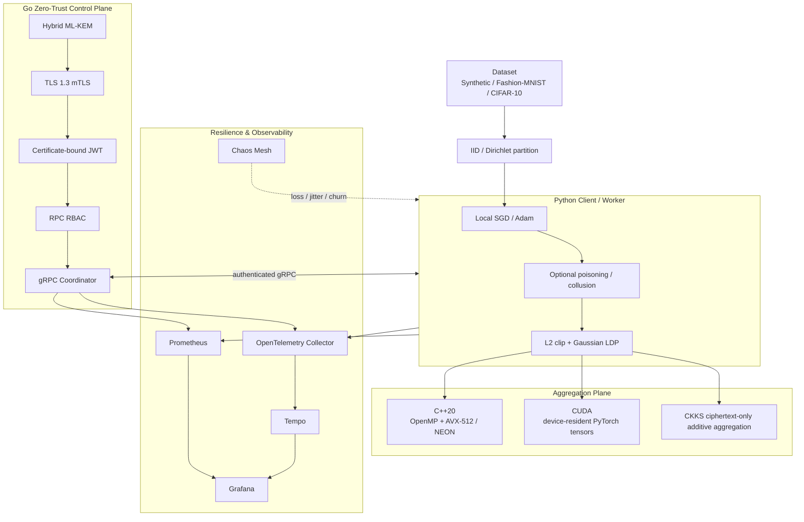

# ZeroTrust-FL-Sim

<p align="center">
  <strong>ZeroTrust Federated Learning with Byzantine Resilience, DP + CKKS Privacy, PQC Transport, SIMD/CUDA Acceleration, Chaos Engineering, and Full Observability</strong>
</p>

<p align="center">
  A reproducible research platform for federated learning under non-IID data, malicious clients, privacy leakage, network faults, node churn, coordinated Byzantine attacks, and zero-trust transport constraints.
</p>

<p align="center">
  
  
  
  
  
  
  
  
  
  
  <a href="https://github.com/smshagor-dev/ZeroTrust-FL-Sim/actions/workflows/ci.yml">
    
  </a>
  <a href="https://github.com/smshagor-dev/ZeroTrust-FL-Sim/blob/main/LICENSE">
    
  </a>
</p>

---

## Initial Information

**ZeroTrust-FL-Sim** is a software-only federated-learning security and resilience testbed. It deliberately separates learning robustness, privacy, encrypted computation, CPU/GPU acceleration, identity, transport security, failure injection, and observability so each claim can be tested independently.

The repository currently combines:

- deterministic IID and Dirichlet non-IID partitioning;
- asynchronous persistent PyTorch worker processes;
- SGD/Adam local training with simulated compute/network delay;
- label-flip, Gaussian, sign-flip, adaptive, and **round-synchronized Byzantine collusion** attacks;
- native C++20 Krum, Multi-Krum, trimmed mean, and coordinate median;
- OpenMP parallelism with runtime-dispatched **AVX-512** or **ARM NEON** squared-distance kernels and scalar fallback;
- optional device-resident **CUDA Krum/Multi-Krum and trimmed-mean kernels** for contiguous PyTorch CUDA tensors;
- release-level Local Differential Privacy using L2 clipping + Gaussian noise + Rényi-Degree accounting;
- CKKS homomorphic encrypted addition using Microsoft SEAL 4.4.3;
- TLS 1.3 mTLS, certificate-bound JWT authorization, hybrid ML-KEM, and optional ML-DSA identities;
- **Chaos Mesh** profiles for 50% packet loss, network jitter, and random worker pod failure;
- OpenTelemetry distributed tracing in the Go coordinator and Python gRPC workers;
- Prometheus metrics for training time, RPC latency, memory, aggregation time, node churn, and poisoning mitigation;
- an opt-in **Grafana + Prometheus + Tempo + OpenTelemetry Collector** stack with a provisioned `dashboard.json`;
- Docker Compose testbeds, CI validation, reproducible benchmarks, and security-focused documentation.

> **Scope:** 50% Byzantine collusion is intentionally an extreme stress regime. It exceeds the fault assumptions of Krum and should be used to study degradation/failure behavior, not to claim a resilience guarantee at 50% adversarial control.

---

# System Architecture



The Go coordinator is the authenticated network/control plane. It validates and accepts updates but does **not** perform native model aggregation or advance the global FL model. Aggregation CPU/GPU memory and poisoning-mitigation metrics therefore originate from the telemetry-enabled local simulator, while worker network/training metrics and coordinator RPC metrics originate from the distributed control-plane processes.

---

# Federated Learning Model

For client `k` with local data `D_k`:

```math
F_k(W)=\frac{1}{N_k}\sum_{i=1}^{N_k}\ell(W;x_{k,i},y_{k,i}).
```

At round `t`:

```math
\Delta_k^{(t)}=W_k^{(t)}-W^{(t)}.
```

A weighted mean update is:

```math
\widehat{\Delta}^{(t)}
=\frac{\sum_k w_k\Delta_k^{(t)}}{\sum_k w_k}.
```

The model advances as:

```math
W^{(t+\!1)}=W^{(t)}+\widehat{\Delta}^{(t)}.
```

For class `c`, Dirichlet non-IID partitioning samples:

```math
\mathbf{p}^{(c)}\sim\mathrm{Dir}_K(\alpha\mathbf{1}_K).
```

Smaller `alpha` produces stronger client class skew; larger `alpha` approaches IID-like allocation.

---

# Byzantine Attack and Robust Aggregation Model

Supported attack modes:

```text
none
label_flip
gaussian
sign_flip
adaptive
collusion
```

For sign flip:

```math
\widetilde{g}_i=-\gamma g_i.
```

For additive Gaussian poisoning:

```math
\widetilde{W}_i=W_i+\mathcal{N}(0,\sigma^2 I).
```

The coordinated collusion stress mode uses a shared round direction. With model dimension `d`, shared sign vector `s_t` with entries in `{-1,+1}`, local update `g_i`, and scale `gamma`:

```math
\widetilde{g}_i^{(t)}
=\gamma\lVert g_i^{(t)}\rVert_2
\frac{s_t}{\sqrt{d}}.
```

All colluding clients with the same `collusion_seed` use the same `s_t` during a round.

## Krum and Multi-Krum

Krum requires:

```math
n\ge2f+3.
```

The score for client `i` is:

```math
S_i=\sum_{j\in\mathcal{N}_i}\lVert W_i-W_j\rVert_2^2,
```

where `N_i` contains the `n-f-2` nearest other updates. Multi-Krum averages the lowest-score candidates.

## Trimmed mean

The implementation removes:

```math
b=\lfloor\beta n\rfloor
```

values from both coordinate tails and averages the retained `n-2b` values.

## Coordinate median

Median is coordinate-wise rather than a geometric/spatial median.

---

# SIMD and CUDA Acceleration

The native aggregation core keeps OpenMP for outer parallelism and adds explicit CPU SIMD runtime dispatch for the Krum distance hot path:

```text
x86/x86-64 + supported compiler + CPU AVX-512/FMA -> avx512
AArch64                                        -> neon
otherwise                                      -> scalar
```

Runtime dispatch prevents an AVX-512 optimized build from blindly executing unsupported instructions on another CPU.

For Krum, pairwise distance complexity remains:

```math
T_{Krum}=O(n^2d).
```

SIMD and CUDA reduce the constant factor/parallel execution time; they do not change that asymptotic complexity.

The CUDA path consumes existing contiguous `torch.float32` CUDA tensor `data_ptr()` storage directly. It does not stage model-sized updates through CPU memory. PyTorch CUDA IPC-mapped tensors can use the same native pointer path after PyTorch has safely established the shared mapping.

For billion-scale dimensions, CUDA Krum distance computation is parameter-chunked rather than assigning only one block per client pair, allowing high GPU occupancy even when `n` is small.

Build controls:

```text
ZTFL_ENABLE_CUDA=AUTO   # default; enable when a CUDA compiler is found
ZTFL_ENABLE_CUDA=ON     # CUDA is required
ZTFL_ENABLE_CUDA=OFF    # portable CPU-only build
```

Detailed design: [`docs/accelerated-aggregation.md`](docs/accelerated-aggregation.md).

---

# Local Rényi Differential Privacy

Before an honest client's update leaves the process, the release-level LDP path clips:

```math
\bar{u}=u\cdot\min\left(1,\frac{C}{\lVert u\rVert_2}\right).
```

Replacement adjacency uses:

```math
\Delta_2\le2C.
```

Add/remove adjacency uses:

```math
\Delta_2\le C.
```

With noise multiplier `sigma`:

```math
\widetilde{u}=\bar{u}+\mathcal{N}\left(0,\sigma^2\Delta_2^2I\right).
```

For a full-participation Gaussian mechanism at RDP order `alpha>1`:

```math
\varepsilon_{RDP}(\alpha)=\frac{\alpha}{2\sigma^2}.
```

For `T` releases:

```math
\varepsilon_{RDP}^{(T)}(\alpha)=T\frac{\alpha}{2\sigma^2}.
```

Conversion to an `(epsilon, delta)` upper bound:

```math
\varepsilon(\delta)=
\min_{\alpha>1}
\left[
\varepsilon_{RDP}^{(T)}(\alpha)
+\frac{\ln(1/\delta)}{\alpha-1}
\right].
```

Example with replacement adjacency, `C=1`, `sigma=2`, `T=10`, `delta=1e-5`: sensitivity is `2`, coordinate noise standard deviation is `4`, and at `alpha=8` the converted bound is approximately `11.6447`. The runtime searches configured orders and may report a smaller valid bound.

This is whole-update release-level LDP, not per-example DP-SGD.

---

# CKKS Homomorphic Encrypted Aggregation

The native encrypted path uses Microsoft SEAL 4.4.3. TenSEAL remains an optional interoperability/experimentation extra.

Default profile:

```text
poly_modulus_degree = 8192
coeff_modulus_bits = [60, 40, 40, 60]
scale = 2^40
slots_per_ciphertext = 4096
```

For client update `u_i` and weight `w_i`:

```math
c_i=Enc_{pk}(w_i u_i).
```

The server performs ciphertext-only addition:

```math
c_{sum}=\sum_i c_i
=Enc_{pk}\left(\sum_iw_i u_i\right).
```

A separate decryptor obtains the weighted mean:

```math
u_{avg}=\frac{Dec_{sk}(c_{sum})}{\sum_iw_i}.
```

For dimension `d`, ciphertext chunk count is:

```math
N_{chunks}=\left\lceil\frac{d}{4096}\right\rceil.
```

For `d=10,000,000`:

```math
N_{chunks}=2442.
```

This is a ciphertext count, not serialized byte size.

CKKS addition does not implement Krum/median/trimmed-mean comparisons; encrypted Byzantine-robust comparison requires a different cryptographic protocol.

Detailed design: [`docs/privacy-rdp-ckks.md`](docs/privacy-rdp-ckks.md).

---

# Post-Quantum Zero-Trust Transport

The Go control plane exposes:

| Mode | Hybrid ML-KEM | Classical fallback |
| --- | --- | --- |
| `off` | disabled | yes |
| `prefer` | preferred | yes |
| `require` | required | no |

Strict identity mode can additionally require ML-DSA certificates.

For `X25519MLKEM768`, raw key-share sizes are:

```text
classical X25519:       32 + 32 =   64 bytes
X25519MLKEM768 hybrid: 1216 + 1120 = 2336 bytes
increase:                              2272 bytes
combined multiplier:                    36.5x
```

```math
\Delta B=2336-64=2272\ \mathrm{bytes}.
```

```math
R=\frac{2336}{64}=36.5.
```

These numbers cover raw key shares only, not the complete TLS/gRPC request.

Detailed design: [`docs/pqc-transport.md`](docs/pqc-transport.md).

---

# Resilience & Resilience Stack

## Chaos Mesh failure injection

The Kubernetes interface under `deploy/chaos/chaos-mesh/` contains:

| Profile | Configuration |
| --- | --- |
| 50% packet loss | bidirectional `loss: 50`, 25% correlation, 60 s |
| Network jitter | 150 ms latency, 100 ms jitter, 50% correlation, 60 s |
| Node churn | `PodChaos` `pod-failure`, random max 50% of workers, 30 s |

Worker pods are selected by:

```text
namespace: zerotrust-fl
app.kubernetes.io/component: worker
```

### Packet-loss calculation

Under an idealized independent-loss model with `p=0.5`, delivery within `k` attempts is:

```math
P_{delivery}(k)=1-p^k.
```

For three attempts:

```math
P_{delivery}(3)=1-0.5^3=0.875.
```

The actual Chaos Mesh profile has correlated loss, while TCP/gRPC also performs retransmission/congestion-control behavior, so `0.875` is **not** a prediction of measured RPC success.

### Node-churn calculation

The simulator exports:

```math
C_t=\frac{F_t+S_t}{N_t},
```

where `F_t` is failed clients, `S_t` is stragglers, and `N_t` is selected clients.

### Why 50% Byzantine stress is extreme

Set `f=n/2` in Krum's requirement:

```math
n\ge2f+3
\Rightarrow
n\ge2(n/2)+3
\Rightarrow
n\ge n+3.
```

This cannot be satisfied. The 50% collusion mode intentionally measures how the system fails or degrades outside the theorem's fault bound.

## Poisoning mitigation metric

Let the benign-only mean be `g_b`, the robust aggregate be `g_r`, and the naive all-client mean be `g_m`:

```math
e_r=\lVert g_r-g_b\rVert_2,
\qquad
e_m=\lVert g_m-g_b\rVert_2.
```

The simulator's mitigation score is:

```math
M_t=\mathrm{clip}\left(1-\frac{e_r}{e_m},0,1\right).
```

An attacked round is considered mitigated when:

```math
e_r<e_m.
```

Running mitigation rate:

```math
R_{mitigation}
=\frac{\text{mitigated attacked rounds}}{\text{attacked rounds}}.
```

This is empirical robustness telemetry, not a proof.

---

# OpenTelemetry + Prometheus + Grafana

The live instrumentation is split by responsibility:

- **Go coordinator:** OTel gRPC server spans + Promises RPC latency/request counters;
- **Python gRPC worker:** parent worker-cycle spans, automatic gRPC client spans, epoch/update time, client-observed RPC latency, process/GPU memory, accepted/rejected update counters;
- **local simulator:** round spans, aggregation spans, aggregator CPU/GPU memory overhead, churn rate, mitigation score/rate.

Important metrics:

```text
ztfl_epoch_duration_seconds
ztfl_network_latency_seconds
ztfl_grpc_server_latency_seconds
ztfl_aggregation_duration_seconds
ztfl_aggregator_cpu_memory_overhead_bytes
ztfl_aggregator_gpu_memory_overhead_bytes
ztfl_process_resident_memory_bytes
ztfl_gpu_memory_bytes
ztfl_node_churn_rate
ztfl_poisoning_mitigation_score
ztfl_poisoning_mitigation_rate
ztfl_updates_total
```

CPU aggregation memory overhead is currently the non-negative RSS before/after delta:

```math
\Delta M_{CPU}=\max(0,RSS_{after}-RSS_{before}).
```

It is not a sampled peak-RSS profiler.

CUDA overhead uses PyTorch peak allocation above the pre-aggregation baseline:

```math
\Delta M_{GPU}=\max(0,M_{peak}-M_{before}).
```

The preconfigured dashboard is:

```text
observability/grafana/dashboards/dashboard.json
```

It contains live panels for epoch time, network/gRPC latency, CPU/GPU memory overhead, aggregation time, node churn, poisoning mitigation score, and poisoning mitigation rate. It does not contain fabricated benchmark values.

Detailed design: [`docs/resilience-observability.md`](docs/resilience-observability.md).

---

# Run the Observability Stack

The stack is opt-in:

```bash
docker compose \
  -f docker-compose.yml \
  -f docker-compose.observability.yml \
  up -d --build
```

Provisioned components:

```text
OpenTelemetry Collector 0.159.0
Grafana Tempo            3.0.3
Prometheus               3.14.0
Grafana                  13.2.0
```

Local endpoints:

```text
Grafana       http://localhost:3000
Prometheus    http://localhost:9090
Tempo API     http://localhost:3200
OTLP/gRPC     localhost:4317
OTLP/HTTP     localhost:4318
```

The overlay also starts a synthetic 50% collusion simulator so aggregator memory/mitigation dashboard panels have a valid metric source. This simulator is distinct from the Go network control plane.

Stop:

```bash
docker compose \
  -f docker-compose.yml \
  -f docker-compose.observability.yml \
  down -v --remove-orphans
```

---

# Run Chaos Experiments

Install Chaos Mesh in the Kubernetes cluster first, then ensure worker pods have the required label.

50% packet loss:

```bash
kubectl apply -f deploy/chaos/chaos-mesh/network-loss-50.yaml
```

Network jitter:

```bash
kubectl apply -f deploy/chaos/chaos-mesh/network-jitter.yaml
```

Random node churn:

```bash
kubectl apply -f deploy/chaos/chaos-mesh/node-churn.yaml
```

50% coordinated Byzantine simulator:

```bash
python scripts/run_fl_sim.py \
  --clients 20 \
  --clients-per-round 20 \
  --min-results 20 \
  --malicious-fraction 0.50 \
  --attack collusion \
  --collusion-scale 8 \
  --aggregator median \
  --rounds 10 \
  --telemetry
```

Run one infrastructure fault at a time before combining failures; otherwise causal attribution becomes difficult.

---

# Repository Structure

```text
ZeroTrust-FL-Sim/
├── .github/
│   ├── ISSUE_TEMPLATE/
│   ├── CODEOWNERS
│   ├── PULL_REQUEST_TEMPLATE.md
│   └── workflows/
├── benchmarks/
│   ├── benchmark_suite.py
│   └── benchmark_acceleration.py
├── CHANGELOG.md
├── CITATION.cff
├── CODE_OF_CONDUCT.md
├── CONTRIBUTING.md
├── cmd/coordinator/
├── cpp/
│   ├── include/
│   │   ├── byzantine_aggregator.hpp
│   │   ├── ckks_secure_aggregation.hpp
│   ├── LICENSE
│   ├── NOTICE
│   ├── SECURITY.md
│   ├── SUPPORT.md
│   │   ├── cuda_aggregation.hpp
│   │   └── simd_distance.hpp
│   └── src/
│       ├── aggregator_pybind.cpp
│       ├── byzantine_aggregator.cpp
│       ├── ckks_secure_aggregation.cpp
│       ├── cuda_aggregation.cu
│       └── simd_distance.cpp
├── deploy/chaos/
│   ├── README.md
│   └── chaos-mesh/
│       ├── network-loss-50.yaml
│       ├── network-jitter.yaml
│       └── node-churn.yaml
├── docker/
│   ├── Dockerfile.coordinator
│   └── Dockerfile.worker
├── docker-compose.yml
├── docker-compose.observability.yml
├── docs/
│   ├── accelerated-aggregation.md
│   ├── fl-simulation.md
│   ├── native-aggregation.md
│   ├── pqc-transport.md
│   ├── privacy-rdp-ckks.md
│   ├── resilience-observability.md
│   └── security-transport.md
├── fl/zerotrust_fl/
│   ├── aggregators/
│   ├── attacks/
│   ├── client/
│   ├── data/
│   ├── engine/
│   ├── observability/
│   ├── privacy/
│   └── protocols/
├── observability/
│   ├── otel-collector.yaml
│   ├── prometheus.yml
│   ├── tempo.yaml
│   └── grafana/
│       ├── dashboards/dashboard.json
│       └── provisioning/
├── pkg/
│   ├── coordinator/
│   ├── observability/
│   └── security/
├── scripts/
│   ├── demo_ckks_secure_aggregation.py
│   ├── run_fl_sim.py
│   ├── run_grpc_worker.py
│   └── verify_system.sh
└── tests/
    ├── security_test.go
    ├── test_acceleration.py
    ├── test_cpp_aggregator.py
    ├── test_fl_engine.py
    ├── test_master_orchestrator.py
    ├── test_observability.py
    └── test_privacy.py
```

---

# Requirements

- Go 1.27.1+
- Python 3.12+
- PyTorch 2.14.0
- C++20 compiler
- CMake 3.24+
- pybind11 3.1.x
- Protocol Buffers compiler
- Git at native-build time when CKKS is enabled
- Docker Compose v2 for container testbeds
- optional CUDA toolkit/compiler for the CUDA native backend
- optional Kubernetes + Chaos Mesh for infrastructure fault injection

---

# Quickstart

```bash
git clone https://github.com/smshagor-dev/ZeroTrust-FL-Sim.git
cd ZeroTrust-FL-Sim
python3.12 -m venv .venv
source .venv/bin/activate
python -m pip install --upgrade pip setuptools wheel
pip install -r requirements.txt
python scripts/generate_python_proto.py
ZTFL_ENABLE_CKKS=ON pip install -e .
```

Verify native features:

```bash
python -c "import zerotrust_fl_cpp as n; print(n.__version__, n.openmp_enabled, n.simd_backend, n.ckks_enabled, n.cuda_enabled)"
```

Force portable CPU compatibility build:

```bash
ZTFL_NATIVE_ARCH=OFF ZTFL_ENABLE_CUDA=OFF ZTFL_ENABLE_CKKS=ON pip install -e .
```

Require CUDA build:

```bash
ZTFL_ENABLE_CUDA=ON pip install -e .
```

---

# Go Coordinator and PQC

Generate development PKI:

```bash
go run ./security -out certs/dev
```

Run hybrid-preferred mode:

```bash
go run ./cmd/coordinator -pqc-mode prefer
```

Enable trace export to a local collector:

```bash
ZTFL_OTEL_ENDPOINT=localhost:4317 \
ZTFL_OTEL_INSECURE=true \
ZTFL_METRICS_ADDRESS=127.0.0.1:9464 \
go run ./cmd/coordinator -pqc-mode prefer
```

Strict ML-KEM + ML-DSA:

```bash
go run ./security -out certs/pqc -certificate-algorithm mldsa65

go run ./cmd/coordinator \
  -server-cert certs/pqc/server.crt \
  -server-key certs/pqc/server.key \
  -client-ca certs/pqc/ca.crt \
  -jwt-public-key certs/pqc/jwt_signing_public.pem \
  -pqc-mode require \
  -pqc-require-identity
```

---

# Testing

Resilience/observability tests:

```bash
pytest tests/test_observability.py -q
```

Privacy tests:

```bash
pytest tests/test_privacy.py -q
```

All Python/C++ tests:

```bash
pytest -q
```

Go:

```bash
make proto
go mod tidy
go fmt ./...
go vet ./...
go test -v ./...
```

Validate the observability Compose overlay:

```bash
docker compose \
  -f docker-compose.yml \
  -f docker-compose.observability.yml \
  config >/dev/null
```

Full verification:

```bash
./scripts/verify_system.sh
```

---

# Performance and Complexity

For ordinary float32 updates with `n` clients and dimension `d`:

```math
M_{updates}=4nd\ \mathrm{bytes}.
```

Krum's double-precision distance matrix requires approximately:

```math
M_{distance}=8n^2\ \mathrm{bytes}.
```

Baseline complexities:

| Aggregator | Complexity |
| --- | --- |
| Krum | `O(n^2 d)` |
| Multi-Krum | `O(n^2 d + md)` |
| trimmed mean | `O(d n log n)` |
| coordinate median | expected approximately `O(dn)` selection work |

Idealized parallel Krum distance work over `P` effective workers is:

```math
T_{parallel}\approx O\left(\frac{n^2d}{P}\right),
```

subject to memory bandwidth, scheduling, synchronization, GPU occupancy, transfer/launch costs, and the nonparallel fraction.

Run benchmark suites:

```bash
python benchmarks/benchmark_suite.py --profile full
python benchmarks/benchmark_acceleration.py
```

Do not apply plaintext memory formulas to CKKS ciphertext storage.

---

# Security, Resilience, and Measurement Boundaries

## Assumptions

- trust anchors/private authentication keys remain uncompromised;
- CKKS secret keys remain outside the ciphertext-only aggregation role;
- honest LDP clients execute clipping/noise as configured;
- strict PQC claims use `pqc-mode=require` and strict PQC identity claims use ML-DSA certificates;
- Byzantine guarantee claims stay within the selected algorithm's `f` assumptions;
- Chaos Mesh selectors are restricted to the intended test namespace/workers;
- OTLP plaintext mode is used only on a trusted isolated observability network or replaced with authenticated TLS remotely.

## Not implied

- release-level LDP is not per-example DP-SGD;
- CKKS additive aggregation is not encrypted Krum/median comparison;
- AVX-512/CUDA changes performance, not the mathematical fault bound;
- 50% collusion is not within Krum's formal fault assumption;
- Prometheus/Grafana measurements are not formal security guarantees;
- CPU RSS before/after delta is not a true peak-memory profiler;
- tracing does not participate in authentication or authorization decisions;
- PQC transport does not protect compromised endpoints.

---

# Reproducibility Metadata

Record at minimum:

- Git commit SHA;
- Python/PyTorch/Go/CMake/compiler versions;
- SIMD backend and OpenMP state;
- CUDA runtime/device and `ZTFL_ENABLE_CUDA` state;
- Microsoft SEAL version/CKKS parameters;
- dataset, partition strategy, and Dirichlet `alpha`;
- client count, malicious fraction, attack/collusion seed and scale;
- Byzantine bound `f`, aggregator, backend, `k`, and trim ratio;
- LDP adjacency, clip norm, noise multiplier, delta, release count, and RDP orders;
- PQC policy, negotiated TLS group, and certificate algorithm;
- Chaos Mesh profile names/durations/selectors;
- OTel/Prometheus/Grafana component versions;
- random seeds and round count.

---

# Documentation

- [`docs/accelerated-aggregation.md`](docs/accelerated-aggregation.md) — AVX-512/NEON/CUDA design and zero-copy boundary.
- [`docs/resilience-observability.md`](docs/resilience-observability.md) — Chaos Mesh, collusion, OTel, Promises, Grafana, metrics calculations.
- [`deploy/chaos/README.md`](deploy/chaos/README.md) — Chaos Mesh run profiles.
- [`docs/privacy-rdp-ckks.md`](docs/privacy-rdp-ckks.md) — LDP/RDP and CKKS.
- [`docs/pqc-transport.md`](docs/pqc-transport.md) — ML-KEM/ML-DSA transport and wire-size math.
- [`docs/security-transport.md`](docs/security-transport.md) — mTLS, identity, JWT, RBAC.
- [`docs/native-aggregation.md`](docs/native-aggregation.md) — robust native aggregation.
- [`docs/fl-simulation.md`](docs/fl-simulation.md) — asynchronous FL simulator.

---

# Contributing, Support, and Security

Contributions are welcome. See [`CONTRIBUTING.md`](CONTRIBUTING.md) for development, testing, reproducibility, and pull-request requirements, and [`CODE_OF_CONDUCT.md`](CODE_OF_CONDUCT.md) for community expectations.

For technical support and reproducibility reports, see [`SUPPORT.md`](SUPPORT.md). Security vulnerabilities must not be disclosed in public issues; follow the private reporting process in [`SECURITY.md`](SECURITY.md).

---

# Citation

If you use ZeroTrust-FL-Sim in research, cite the software and record the exact tag or Git commit used for the experiment. Machine-readable citation metadata is provided in [`CITATION.cff`](CITATION.cff).

---

# License

ZeroTrust-FL-Sim is licensed under the **Apache License 2.0**. See [`LICENSE`](LICENSE) for the full license terms and [`NOTICE`](NOTICE) for project attribution notices. Third-party dependencies and bundled components remain subject to their respective licenses.

---

# Repository

**GitHub:** https://github.com/smshagor-dev/ZeroTrust-FL-Sim

The project keeps the research pipeline explicit:

**non-IID learning → adversarial/colluding updates → Local DP → robust or CKKS aggregation → SIMD/CUDA acceleration → PQC mTLS + zero-trust authorization → chaos injection → OpenTelemetry/Prometheus measurement → Grafana analysis**.