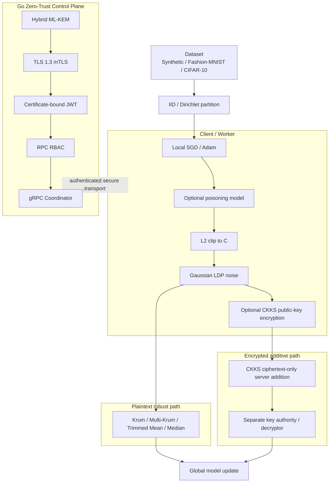

# ZeroTrust-FL-Sim

<p align="center">
  <strong>Zero-Trust Federated Learning with Byzantine-Robust Aggregation, Local Differential Privacy, CKKS Encrypted Computation, and Post-Quantum Transport</strong>
</p>

<p align="center">
  A reproducible research platform for secure federated learning under non-IID data, asynchronous execution, malicious clients, gradient/model-update leakage, Byzantine poisoning, zero-trust network controls, and post-quantum transport.
</p>

<p align="center">
  
  
  
  
  
  
  <a href="https://github.com/smshagor-dev/ZeroTrust-FL-Sim/actions/workflows/ci.yml">
    
  </a>
</p>

---

## Initial Information

**ZeroTrust-FL-Sim** is a software-only federated-learning security testbed. It separates learning robustness, privacy, encrypted computation, identity, authorization, and transport security so each guarantee can be measured independently.

The repository currently combines:

- deterministic IID and Dirichlet non-IID partitioning;
- asynchronous persistent PyTorch worker processes;
- SGD/Adam local training and simulated compute/network delay;
- label-flipping, Gaussian, sign-flipping, and adaptive poisoning attacks;
- native C++20 Krum, Multi-Krum, trimmed mean, and coordinate median;
- OpenMP/SIMD native acceleration through `pybind11`;
- **release-level Local Differential Privacy** using L2 clipping + Gaussian noise + Rényi-DP accounting;
- **CKKS homomorphic encrypted addition** in the C++20 core using Microsoft SEAL 4.4.3;
- separated CKKS client/public-key, ciphertext-only server aggregation, and secret-key decryptor roles;
- TLS 1.3 mutual authentication;
- hybrid ML-KEM key exchange with `off`, `prefer`, and `require` policies;
- optional ML-DSA-65 X.509 identities for strict post-quantum mTLS;
- certificate-bound JWT identity and role-based gRPC authorization;
- Docker Compose testbed, automated verification, and micro-benchmarks.

### Threats addressed by the privacy layer

A plaintext model update can leak training information through gradient/model inversion and related inference attacks. The new privacy layer uses two different protections:

1. **LDP:** limits what can be inferred from an honest client's released update even when a recipient can see the released vector.
2. **CKKS:** prevents the aggregation server from seeing individual plaintext updates while still allowing encrypted addition.

These are complementary, not interchangeable. CKKS does not create a DP guarantee, and DP does not hide the noisy update from its recipient.

> **Scope:** this repository does not claim universal protection against compromised endpoints, a client that deliberately bypasses its local privacy mechanism, stolen decryption keys, malicious trusted CAs, arbitrary backdoors, Byzantine populations above algorithm assumptions, or future cryptanalytic breaks.

---

## System Architecture



The current Go coordinator validates and accepts FL updates but does not perform model aggregation or advance the global model. CKKS is therefore implemented in the native aggregation layer rather than falsely treating the Go control-plane service as an FHE aggregator.

---

# Federated Learning Model

For client `k` with local data `D_k`, the local objective is:

```math
F_k(W)=\frac{1}{N_k}\sum_{i=1}^{N_k}\ell(W;x_{k,i},y_{k,i}).
```

At round `t`, client `k` produces model delta:

```math
\Delta_k^{(t)}=W_k^{(t)}-W^{(t)}.
```

Plain FedAvg-style weighted aggregation is:

```math
\widehat{\Delta}^{(t)}
=\frac{\sum_k w_k\Delta_k^{(t)}}{\sum_k w_k}.
```

The model advances as:

```math
W^{(t+1)}=W^{(t)}+\widehat{\Delta}^{(t)}.
```

---

# Local Rényi Differential Privacy

The worker applies privacy protection **after local training/optional simulated attack and before the update leaves the client process**. The same order is used by the long-lived gRPC worker immediately before `SubmitLocalUpdate`.

## Clipping

For raw update `u` and clipping radius `C`:

```math
\bar{u}=u\cdot\min\left(1,\frac{C}{\lVert u\rVert_2}\right).
```

Replacement adjacency uses the conservative release-level sensitivity bound:

```math
\Delta_2\le 2C.
```

Add/remove adjacency uses:

```math
\Delta_2\le C.
```

## Gaussian mechanism

With noise multiplier `sigma`:

```math
\tilde{u}=\bar{u}+\mathcal{N}\left(0,\sigma^2\Delta_2^2 I\right).
```

Therefore the coordinate noise standard deviation is:

```math
\sigma_{noise}=\sigma\Delta_2.
```

## Rényi-DP accounting

For the full-participation Gaussian mechanism (`q=1`), one release at RDP order `alpha>1` has:

```math
\varepsilon_{RDP}(\alpha)=\frac{\alpha}{2\sigma^2}.
```

For `T` releases:

```math
\varepsilon_{RDP}^{(T)}(\alpha)=T\frac{\alpha}{2\sigma^2}.
```

Conversion to an `(epsilon, delta)` upper bound uses:

```math
\varepsilon(\delta)=
\min_{\alpha>1}
\left[
\varepsilon_{RDP}^{(T)}(\alpha)
+\frac{\ln(1/\delta)}{\alpha-1}
\right].
```

The simulator searches configured RDP orders and reports the minimum bound.

## DP calculation example

Use replacement adjacency with:

```text
C = 1
sigma = 2
T = 10 releases
delta = 1e-5
```

Sensitivity:

```math
\Delta_2=2C=2.
```

Noise standard deviation:

```math
\sigma_{noise}=\sigma\Delta_2=2\times2=4.
```

At `alpha=8`:

```math
\varepsilon_{RDP}^{(10)}(8)
=10\frac{8}{2\times2^2}
=10.
```

Conversion at that order:

```math
\varepsilon
=10+\frac{\ln(10^5)}{7}
\approx11.6447.
```

This is an example at one order. The runtime accountant evaluates all configured orders and may return a smaller valid bound.

### Important DP boundary

This is **release-level Local DP for the whole model-update vector**, not per-example DP-SGD. It protects a clipped update release under the configured adjacency definition. If per-training-example privacy is required during local optimization, a per-sample-gradient mechanism such as DP-SGD is a separate requirement.

Deterministic seeds are used only to make simulator experiments reproducible. Production clients must use a cryptographically appropriate random source.

---

# CKKS Homomorphic Encrypted Aggregation

The live native backend uses **Microsoft SEAL 4.4.3** directly. TenSEAL 0.3.17 is retained as an optional experimentation/interoperability extra; its current release reports Microsoft SEAL 4.3.3, while the SEAL 4.4.x line contains the newer security hardening.

Default CKKS profile:

```text
poly_modulus_degree = 8192
coeff_modulus_bits = [60, 40, 40, 60]
scale = 2^40
slots_per_ciphertext = 4096
```

CKKS is approximate arithmetic, so decrypted values can contain small numerical error.

## Key separation

The native API intentionally separates roles:

- `CKKSKeyMaterial.generate()` — key authority creates parameters/public/secret keys;
- `CKKSClientEncryptor` — client receives public material only;
- `CKKSServerAggregator` — server receives parameters + ciphertexts only;
- `CKKSDecryptor` — secret key remains outside the aggregation server.

For client update `u_i` with weight `w_i`:

```math
c_i=Enc_{pk}(w_i u_i).
```

The aggregation server performs only encrypted addition:

```math
c_{sum}=\sum_i c_i
=Enc_{pk}\left(\sum_iw_i u_i\right).
```

A separate decryptor recovers the weighted mean:

```math
u_{avg}
=\frac{Dec_{sk}(c_{sum})}{\sum_iw_i}.
```

The server-side aggregation class has no secret-key input.

## CKKS chunk calculation

For flattened model dimension `d`, with 4096 CKKS slots per ciphertext:

```math
N_{chunks}=\left\lceil\frac{d}{4096}\right\rceil.
```

For `d=10^7` parameters:

```math
N_{chunks}
=\left\lceil\frac{10,000,000}{4096}\right\rceil
=2442.
```

This is a **ciphertext count**, not a byte-size estimate. Serialized ciphertext size depends on SEAL parameters, ciphertext level, and serialization configuration and should be benchmarked directly.

## Why CKKS does not replace Byzantine aggregation

The encrypted path currently supports additive sum/weighted FedAvg-style operations. Existing Krum, Multi-Krum, median, and trimmed-mean methods require distance comparison, selection, sorting, or order statistics. Those are not equivalent to simple CKKS addition.

Therefore:

- **plaintext robust path:** Krum / Multi-Krum / trimmed mean / median;
- **encrypted additive path:** CKKS sum / weighted mean.

Fully encrypted Byzantine-robust comparison requires a different protocol such as MPC, comparison circuits, trusted execution, or specialized approximate comparison methods.

Detailed privacy design: [`docs/privacy-rdp-ckks.md`](docs/privacy-rdp-ckks.md).

---

# Native C++20 Byzantine-Robust Aggregation

The module `zerotrust_fl_cpp` exposes:

```text
krum_aggregate
trimmed_mean_aggregate
median_aggregate
ckks_generate_key_material
ckks_encrypt
ckks_add
ckks_decrypt
```

Krum requires:

```math
n\ge 2f+3.
```

Its score for client `i` is the sum of squared Euclidean distances to its `n-f-2` closest peers:

```math
S_i=\sum_{j\in\mathcal{N}_i}\lVert W_i-W_j\rVert_2^2.
```

Multi-Krum averages the `m` lowest-score candidates. Trimmed mean removes `floor(beta*n)` values from each coordinate tail. Median is coordinate-wise median.

Detailed native aggregation design: [`docs/native-aggregation.md`](docs/native-aggregation.md).

---

# Post-Quantum Zero-Trust Transport

The Go control plane uses TLS 1.3 mTLS and exposes three PQC policies:

| Mode | Hybrid ML-KEM | Classical fallback |
| --- | --- | --- |
| `off` | disabled | yes |
| `prefer` | preferred | yes |
| `require` | required | no |

Strict post-quantum identity mode additionally requires ML-DSA leaf certificates.

For `X25519MLKEM768`, raw key-share sizes are:

```text
classical X25519:       32 + 32 =   64 bytes
X25519MLKEM768 hybrid: 1216 + 1120 = 2336 bytes
absolute increase:                    2272 bytes
combined multiplier:                  36.5x
```

The calculation is:

```math
\Delta B=2336-64=2272\ \mathrm{bytes},
\qquad
R=\frac{2336}{64}=36.5.
```

These numbers cover raw TLS key shares only, not certificates, TLS records, TCP/IP, HTTP/2, gRPC, or FL payloads.

Detailed transport design: [`docs/pqc-transport.md`](docs/pqc-transport.md).

---

# Data Heterogeneity and Attack Model

For class `c`, non-IID allocation samples:

```math
\mathbf{p}^{(c)}\sim\mathrm{Dir}_K(\alpha\mathbf{1}_K).
```

Small `alpha` creates stronger heterogeneity; large `alpha` approaches IID-like allocation.

Supported attack modes:

```text
none
label_flip
gaussian
sign_flip
adaptive
```

Supported robust aggregators:

```text
mean
krum
multi_krum
trimmed_mean
median
```

---

# Repository Structure

```text
ZeroTrust-FL-Sim/
├── .github/workflows/ci.yml
├── benchmarks/benchmark_suite.py
├── cmd/coordinator/
├── cpp/
│   ├── include/
│   │   ├── byzantine_aggregator.hpp
│   │   └── ckks_secure_aggregation.hpp
│   └── src/
│       ├── byzantine_aggregator.cpp
│       ├── ckks_secure_aggregation.cpp
│       └── aggregator_pybind.cpp
├── docker/
│   ├── Dockerfile.coordinator
│   └── Dockerfile.worker
├── docs/
│   ├── fl-simulation.md
│   ├── native-aggregation.md
│   ├── pqc-transport.md
│   ├── privacy-rdp-ckks.md
│   └── security-transport.md
├── fl/zerotrust_fl/
│   ├── aggregators/
│   ├── attacks/
│   ├── client/
│   ├── data/
│   ├── engine/
│   ├── privacy/
│   │   ├── rdp.py
│   │   └── ckks.py
│   └── protocols/
├── pkg/security/
├── proto/fl_service.proto
├── scripts/
│   ├── demo_ckks_secure_aggregation.py
│   ├── generate_python_proto.py
│   ├── run_fl_sim.py
│   ├── run_grpc_worker.py
│   └── verify_system.sh
├── security/certgen.go
└── tests/
    ├── security_test.go
    ├── test_cpp_aggregator.py
    ├── test_fl_engine.py
    └── test_privacy.py
```

---

# Requirements

- Go 1.27.1 or compatible newer release
- Python 3.12+
- PyTorch 2.14.0
- C++20 compiler
- CMake 3.24+
- pybind11 3.1.x
- Git available at native-build time when CKKS is enabled
- Protocol Buffers compiler
- Docker Compose v2 for the container testbed

The CKKS build fetches the pinned Microsoft SEAL source through CMake `FetchContent`. Set `ZTFL_ENABLE_CKKS=OFF` for a minimal native build that does not fetch SEAL.

---

# Quickstart

```bash
git clone https://github.com/smshagor-dev/ZeroTrust-FL-Sim.git
cd ZeroTrust-FL-Sim
python3.12 -m venv .venv
source .venv/bin/activate
python -m pip install --upgrade pip setuptools wheel
pip install -r requirements.txt
python scripts/generate_python_proto.py
ZTFL_ENABLE_CKKS=ON pip install -e .
```

Windows PowerShell activation:

```powershell
py -3.12 -m venv .venv
.\.venv\Scripts\Activate.ps1
```

Verify native features:

```bash
python -c "import zerotrust_fl_cpp as n; print(n.__version__, n.openmp_enabled, n.ckks_enabled)"
```

Portable CPU build:

```bash
ZTFL_NATIVE_ARCH=OFF ZTFL_ENABLE_CKKS=ON pip install -e .
```

Minimal build without CKKS:

```bash
ZTFL_ENABLE_CKKS=OFF pip install -e .
```

Optional TenSEAL experimentation:

```bash
pip install -e '.[tenseal]'
```

---

# Run Local DP Simulation

```bash
python scripts/run_fl_sim.py \
  --dataset synthetic \
  --clients 10 \
  --rounds 10 \
  --partition dirichlet \
  --alpha 0.3 \
  --aggregator mean \
  --dp \
  --dp-clip-norm 1.0 \
  --dp-noise-multiplier 2.0 \
  --dp-delta 1e-5 \
  --dp-adjacency replace
```

The command prints the configured sensitivity/noise standard deviation and a conservative per-client composed RDP budget assuming participation in every configured round.

For the long-lived gRPC worker:

```bash
ZTFL_DP_ENABLED=true \
ZTFL_DP_CLIP_NORM=1.0 \
ZTFL_DP_NOISE_MULTIPLIER=2.0 \
ZTFL_DP_DELTA=1e-5 \
python scripts/run_grpc_worker.py
```

---

# Run CKKS Secure Aggregation Demo

```bash
python scripts/demo_ckks_secure_aggregation.py \
  --dimension 10000 \
  --clients 4
```

The demo reports:

- model dimension;
- CKKS slots per ciphertext;
- ciphertext chunk count;
- maximum/mean absolute approximate-decoding error;
- confirmation that the aggregation server has no secret-key role.

Python API example:

```python
from zerotrust_fl.privacy import (
    CKKSClientEncryptor,
    CKKSDecryptor,
    CKKSKeyMaterial,
    CKKSServerAggregator,
)

keys = CKKSKeyMaterial.generate()
public = keys.public_bundle()
client = CKKSClientEncryptor(public)
server = CKKSServerAggregator(public.parameters)
decryptor = CKKSDecryptor(keys)

c1 = client.encrypt([1.0, 2.0], weight=100)
c2 = client.encrypt([3.0, 4.0], weight=50)
encrypted_sum = server.aggregate([c1, c2])
weighted_mean = decryptor.decrypt_weighted_mean(encrypted_sum)
```

---

# Go Coordinator and PQC

Generate interoperable development PKI:

```bash
go run ./security -out certs/dev
```

Run hybrid-preferred mode:

```bash
go run ./cmd/coordinator -pqc-mode prefer
```

Strict Go-to-Go ML-KEM + ML-DSA:

```bash
go run ./security \
  -out certs/pqc \
  -certificate-algorithm mldsa65

go run ./cmd/coordinator \
  -server-cert certs/pqc/server.crt \
  -server-key certs/pqc/server.key \
  -client-ca certs/pqc/ca.crt \
  -jwt-public-key certs/pqc/jwt_signing_public.pem \
  -pqc-mode require \
  -pqc-require-identity
```

---

# Docker Testbed

```bash
mkdir -p benchmarks/results
docker compose build
docker compose up -d --wait
docker compose ps
```

Stop:

```bash
docker compose down -v --remove-orphans
```

The worker image builds the same CKKS-enabled native extension used by Python CI. Local DP remains configurable at worker runtime rather than hard-coded into the image.

---

# Testing

Privacy tests:

```bash
pytest tests/test_privacy.py -q
```

All Python/C++ tests:

```bash
pytest -q
```

Go:

```bash
make proto
go mod tidy
go fmt ./...
go vet ./...
go test -v ./...
```

Full verification:

```bash
./scripts/verify_system.sh
```

The privacy tests cover:

- clipping before Gaussian noise;
- deterministic simulation-seed reproducibility;
- RDP composition/conversion math;
- CKKS public/secret role separation;
- encrypted weighted mean correctness;
- vectors requiring multiple CKKS ciphertext chunks.

---

# Performance Benchmarks

```bash
python benchmarks/benchmark_suite.py --profile full
```

The existing suite measures native aggregation, mTLS transport overhead, and convergence under malicious fractions. New DP/CKKS measurements should report actual encryption/decryption latency, ciphertext serialization size, aggregation latency, and accuracy impact rather than relying on hardware-independent estimates.

For ordinary float32 updates with `n` clients and model dimension `d`:

```math
M_{updates}=4nd\ \mathrm{bytes}.
```

Krum's distance matrix adds:

```math
M_{distance}=8n^2\ \mathrm{bytes}.
```

Do not apply these plaintext memory formulas to CKKS ciphertexts.

---

# Security Assumptions and Limitations

## Assumptions

- trust anchors and private authentication keys remain uncompromised;
- CKKS secret key remains outside the aggregation-server process;
- honest LDP clients execute clipping/noise exactly as configured;
- the privacy accountant uses the same adjacency/noise/release assumptions as the experiment;
- strict PQC claims use `pqc-mode=require`;
- strict PQC identity claims use ML-DSA certificates;
- Byzantine bound `f` matches robust-aggregation assumptions.

## Not implied

- Release-level LDP is not per-example DP-SGD.
- CKKS encrypted addition is not Byzantine-robust comparison.
- PQC transport does not protect a compromised endpoint.
- FHE does not replace authentication, RBAC, mTLS, replay protection, or model-integrity controls.
- A ciphertext-only server API does not by itself provide threshold decryption or distributed key custody.

Future production FHE wire integration should additionally bind ciphertexts to round/model IDs, enforce payload limits, authenticate key IDs, rotate keys, prevent replay, and authorize aggregate decryption.

---

# Reproducibility Metadata

Record at minimum:

- Git commit SHA;
- Python/PyTorch/Go/CMake/compiler versions;
- Microsoft SEAL version and CKKS parameter set;
- `ZTFL_ENABLE_CKKS` state;
- OpenMP/native-architecture state;
- dataset, partition strategy, and Dirichlet `alpha`;
- client count, malicious fraction, attack type, and Byzantine bound;
- LDP adjacency, clip norm, noise multiplier, delta, and actual release count;
- RDP orders and reported epsilon;
- CKKS model dimension, slot count, ciphertext chunk count, and measured approximation error;
- PQC policy, negotiated TLS group, and certificate algorithm;
- random seeds and federated round count.

Useful commands:

```bash
git rev-parse HEAD
go version
python --version
python -c "import torch; print(torch.__version__)"
cmake --version
python -c "import zerotrust_fl_cpp as n; print('OpenMP:', n.openmp_enabled, 'CKKS:', n.ckks_enabled)"
```

---

# Documentation

- [`docs/privacy-rdp-ckks.md`](docs/privacy-rdp-ckks.md) — LDP/RDP and CKKS design, calculations, key separation, boundaries.
- [`docs/pqc-transport.md`](docs/pqc-transport.md) — ML-KEM/ML-DSA transport design and wire-size math.
- [`docs/security-transport.md`](docs/security-transport.md) — mTLS, identity, JWT, RBAC.
- [`docs/native-aggregation.md`](docs/native-aggregation.md) — native robust aggregation.
- [`docs/fl-simulation.md`](docs/fl-simulation.md) — FL simulation runtime.

---

# License

This repository currently does **not** declare a repository license. No open-source license should be inferred from public source availability alone.

---

# Repository

**GitHub:** https://github.com/smshagor-dev/ZeroTrust-FL-Sim

ZeroTrust-FL-Sim is designed to keep each security claim explicit and independently testable:

**non-IID learning → adversarial updates → local DP → plaintext robust aggregation or CKKS encrypted addition → post-quantum mTLS → zero-trust authorization → reproducible verification**.
