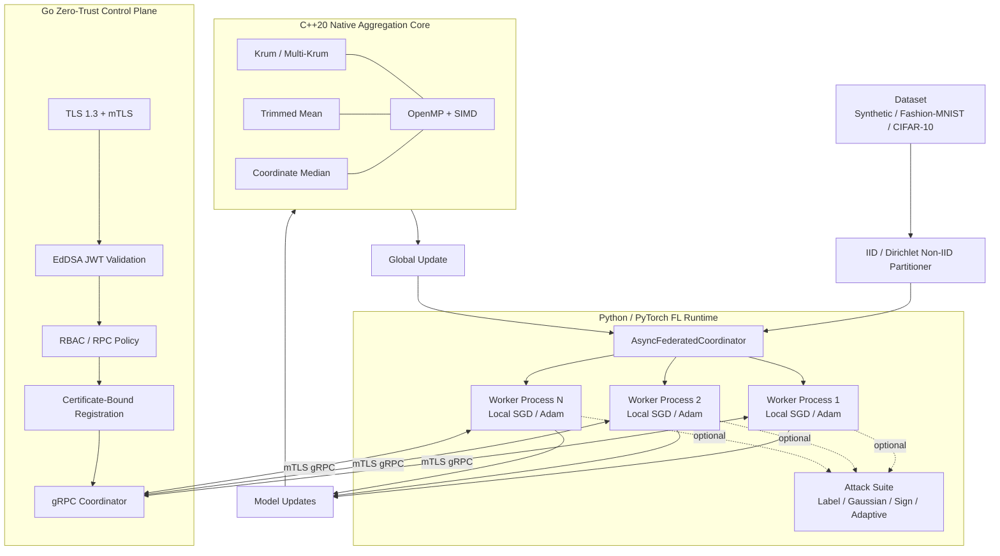

# ZeroTrust-FL-Sim

<p align="center">
  <strong>Zero-Trust Federated Learning Simulation with Byzantine-Robust Native Aggregation</strong>
</p>

<p align="center">
  A reproducible research platform for secure federated learning under non-IID data, asynchronous execution, malicious clients, Byzantine model poisoning, and zero-trust network controls.
</p>

<p align="center">
  
  
  
  
  
  
  <a href="https://github.com/smshagor-dev/ZeroTrust-FL-Sim/actions/workflows/ci.yml">
    
  </a>
</p>

---

## Overview

**ZeroTrust-FL-Sim** is a software-only federated learning platform for evaluating the interaction between learning robustness and zero-trust distributed-systems controls. It combines:

- deterministic IID and Dirichlet non-IID data partitioning;
- asynchronous multi-process PyTorch workers;
- local SGD and Adam training;
- configurable straggler and network-delay simulation;
- label-flipping, Gaussian, sign-flipping, and adaptive poisoning attacks;
- native C++20 Krum, Multi-Krum, trimmed-mean, and coordinate-wise median aggregation;
- OpenMP/SIMD acceleration through a `pybind11` extension;
- TLS 1.3 mutual authentication;
- certificate-bound EdDSA JWT identities;
- role-based gRPC authorization and live registration state;
- Docker Compose orchestration for benign and malicious workers;
- cross-language verification and automated benchmark generation.

The project is intended for research and engineering work in federated learning, trustworthy AI, Byzantine fault tolerance, adversarial machine learning, secure distributed systems, and zero-trust architectures.

> **Scope:** robust aggregation reduces exposure to specified Byzantine update models under explicit assumptions. It is not a universal defense against arbitrary backdoors, compromised training code, malicious data pipelines, stolen private keys, or violations of the assumed Byzantine bound.

---

## System Architecture



The local multiprocessing simulation and the Go network-security control plane are deliberately separable. This makes it possible to evaluate learning robustness independently of transport security, then verify the complete Python-to-Go trust boundary with mutual TLS and JWT authorization.

---

# Mathematical Foundations

> GitHub math note: inline equations in this README use `$...$` and display equations use fenced `math` blocks. This avoids unsupported or inconsistently rendered Markdown/LaTeX delimiters in GitHub README rendering.

## Federated Learning Objective

Let there be $K$ federated clients. Client $k$ owns local dataset:

```math
\mathcal{D}_k = \{(x_{k,i}, y_{k,i})\}_{i=1}^{N_k}.
```

For model parameters $W \in \mathbb{R}^{d}$, client $k$ minimizes:

```math
F_k(W)
=
\frac{1}{N_k}
\sum_{i=1}^{N_k}
\ell(W; x_{k,i}, y_{k,i}).
```

Here, $\ell$ is the task loss and $N_k$ is the number of local samples owned by client $k$.

A conventional weighted global objective is:

```math
F(W)
=
\sum_{k=1}^{K} q_k F_k(W),
\qquad
q_k \ge 0,
\qquad
\sum_{k=1}^{K} q_k = 1.
```

At federated round $t$, worker $k$ receives $W^{(t)}$, performs local optimization, and obtains $W_k^{(t)}$. Its model delta is:

```math
\Delta_k^{(t)} = W_k^{(t)} - W^{(t)}.
```

The server applies aggregation operator $\mathcal{A}$:

```math
\widehat{\Delta}^{(t)}
=
\mathcal{A}
\left(
\Delta_1^{(t)},
\ldots,
\Delta_n^{(t)}
\right).
```

The global model is then updated as:

```math
W^{(t+1)}
=
W^{(t)} + \widehat{\Delta}^{(t)}.
```

For ordinary arithmetic averaging:

```math
\mathcal{A}_{\mathrm{mean}}
=
\frac{1}{n}
\sum_{i=1}^{n}
\Delta_i.
```

A Byzantine worker is not required to obey this local-learning rule and may submit an arbitrary manipulated update instead.

---

## Data Heterogeneity and Non-IID Partitioning

For each class $c$, ZeroTrust-FL-Sim samples a client-proportion vector from a symmetric $K$-dimensional Dirichlet distribution:

```math
\mathbf{p}^{(c)}
\sim
\mathrm{Dir}_K
\left(
\alpha \mathbf{1}_K
\right).
```

A compact FL notation is:

```math
p_k \sim \mathrm{Dir}_K(\alpha).
```

More explicitly:

```math
\mathbf{p}^{(c)}
=
\left(
p_1^{(c)},
\ldots,
p_K^{(c)}
\right),
\qquad
p_k^{(c)} \ge 0,
\qquad
\sum_{k=1}^{K} p_k^{(c)} = 1.
```

The concentration parameter $\alpha>0$ controls heterogeneity:

- **small $\alpha$** produces sparse class allocations and strong client drift;
- **$\alpha \approx 1$** produces moderate heterogeneity;
- **large $\alpha$** concentrates class proportions near $1/K$, approaching an IID-like split.

For the symmetric Dirichlet distribution:

```math
\mathbb{E}\left[p_k^{(c)}\right]
=
\frac{1}{K}.
```

Smaller $\alpha$ increases dispersion around that expectation. The implementation samples class-wise proportions, allocates every source sample exactly once, performs deterministic seeded retries, and can enforce a minimum number of samples per client. An IID baseline is provided through uniform random index partitioning.

---

# Adversarial Threat Formulation

Let $\mathcal{B}$ be the set of compromised clients and let $f=|\mathcal{B}|$ denote the assumed Byzantine count. A malicious worker may manipulate labels before training or directly transform the resulting model update.

## Label-Flipping Attack

Define an attacker-selected target mapping:

```math
f_{\mathrm{label}} : \mathcal{Y} \rightarrow \mathcal{Y}.
```

A poisoned label is:

```math
\widetilde{y}
=
f_{\mathrm{label}}(y)
=
y'.
```

For targeted flipping from source class $a$ to target class $b$:

```math
f_{\mathrm{label}}(y)
=
\begin{cases}
b, & y=a, \\
y, & y\neq a.
\end{cases}
```

The implementation supports arbitrary label mappings and probabilistic activation. For binary labels without an explicit mapping, the two observed classes may be exchanged.

## Additive Gaussian / Matrix Noise Poisoning

For malicious worker $i$, additive model poisoning is:

```math
\widetilde{W}_i
=
W_i + \varepsilon_i.
```

The perturbation is sampled as:

```math
\varepsilon_i
\sim
\mathcal{N}
\left(
\mu \mathbf{1},
\sigma^2 \mathbf{I}_d
\right).
```

For the common zero-mean case:

```math
\widetilde{W}_i
=
W_i
+
\mathcal{N}
\left(
0,
\sigma^2 \mathbf{I}_d
\right).
```

Each coordinate therefore receives independent Gaussian perturbation with variance $\sigma^2$.

## Sign-Flipping Attack

For an honest gradient or model delta $g_i$, a sign-flipping adversary submits:

```math
\widetilde{g}_i
=
-\gamma g_i,
\qquad
\gamma \ge 0.
```

When $\gamma=1$, the direction is exactly inverted. Larger values increase the malicious magnitude.

## Adaptive Norm-Constrained Poisoning

The adaptive attack first forms:

```math
g_i^{\star}
=
-s g_i,
\qquad
s \ge 0.
```

Let the permitted norm envelope be:

```math
r_{\max}
=
\rho \lVert g_i \rVert_2,
\qquad
\rho > 0.
```

The submitted attack is:

```math
\widetilde{g}_i
=
\begin{cases}
g_i^{\star}, & \lVert g_i^{\star}\rVert_2 \le r_{\max}, \\
\displaystyle
r_{\max}
\frac{g_i^{\star}}{\lVert g_i^{\star}\rVert_2},
& \lVert g_i^{\star}\rVert_2 > r_{\max}.
\end{cases}
```

This preserves an attacker-selected opposite direction while constraining the submitted update to a configurable Euclidean norm envelope.

---

# C++20 Byzantine-Robust Aggregation

The native module is `zerotrust_fl_cpp`. PyTorch wrappers expose it through `zerotrust_fl.aggregators.CppByzantineAggregator`.

All client updates must have the same shape and contain finite values. Native input is contiguous `float32`; Krum distances and aggregation sums use `double` accumulation where appropriate.

## Krum and Multi-Krum

Let the $n$ submitted client updates be:

```math
W_1,
W_2,
\ldots,
W_n
\in
\mathbb{R}^{d}.
```

The pairwise squared Euclidean distance is:

```math
D_{ij}
=
\lVert W_i-W_j\rVert_2^2
=
\sum_{r=1}^{d}
\left(
w_{i,r}-w_{j,r}
\right)^2.
```

For client $i$, let $\mathcal{N}_i$ contain its $n-f-2$ nearest peer updates. The Krum score is:

```math
S_i
=
\sum_{j\in\mathcal{N}_i}
\lVert W_i-W_j\rVert_2^2.
```

This is the precise version of the shorthand score:

```math
S_i
=
\sum_{j\in i\rightarrow k}
\lVert W_i-W_j\rVert_2^2.
```

The native implementation requires:

```math
n \ge 2f+3.
```

Its nearest-neighbor set size is:

```math
|\mathcal{N}_i|
=
n-f-2.
```

### Classic Krum

The selected update index is:

```math
i^{\star}
=
\arg\min_i S_i.
```

Classic Krum returns:

```math
\mathcal{A}_{\mathrm{Krum}}
=
W_{i^{\star}}.
```

### Multi-Krum

Let $\mathcal{M}_m$ contain the indices of the $m$ smallest Krum scores, subject to:

```math
1 \le m \le n-f-2.
```

Multi-Krum returns:

```math
\mathcal{A}_{\mathrm{MultiKrum}}
=
\frac{1}{m}
\sum_{i\in\mathcal{M}_m}
W_i.
```

The case $m=1$ reduces to classic Krum.

The native implementation builds a symmetric $n\times n$ distance matrix, selects nearest distances with `std::nth_element`, applies deterministic index tie breaking, and parallelizes distance rows, score calculation, and selected-update averaging with OpenMP.

---

## Adaptive Trimmed Mean

For coordinate $j$, sort the submitted values:

```math
w_j^{(1)}
\le
w_j^{(2)}
\le
\cdots
\le
w_j^{(n)}.
```

A common canonical form sets:

```math
b
=
\lceil \beta n \rceil.
```

It then computes:

```math
\bar{w}_j
=
\frac{1}{n-2\lceil\beta n\rceil}
\sum_{i=\lceil\beta n\rceil+1}^{n-\lceil\beta n\rceil}
w_j^{(i)},
\qquad
0 \le \beta < \frac{1}{2}.
```

### Exact repository operator

The C++ implementation intentionally uses:

```math
b_{\mathrm{impl}}
=
\lfloor \beta n \rfloor.
```

It then computes:

```math
\bar{w}_{j,\mathrm{impl}}
=
\frac{1}{n-2b_{\mathrm{impl}}}
\sum_{i=b_{\mathrm{impl}}+1}^{n-b_{\mathrm{impl}}}
w_j^{(i)}.
```

The implementation additionally requires:

```math
2b_{\mathrm{impl}} < n.
```

This distinction is important for exact experimental reproduction: the canonical equation above uses `ceil`, while the repository executes `floor`.

---

## Coordinate-Wise Median

For each coordinate $j$, let the ordered values satisfy:

```math
w_j^{(1)}
\le
\cdots
\le
w_j^{(n)}.
```

For odd $n$:

```math
\widehat{w}_j
=
w_j^{((n+1)/2)}.
```

For even $n$:

```math
\widehat{w}_j
=
\frac{1}{2}
\left(
w_j^{(n/2)}
+
w_j^{(n/2+1)}
\right).
```

The full coordinate-wise median aggregate is:

```math
\mathcal{A}_{\mathrm{median}}
=
\left(
\widehat{w}_1,
\ldots,
\widehat{w}_d
\right).
```

This is a **coordinate-wise median**, not a geometric or spatial median over $\mathbb{R}^{d}$. Each parameter dimension is solved independently. The implementation uses `std::nth_element`; for even $n$, it combines the upper-middle order statistic with the maximum element below that partition.

---

# Computational Complexity

Let:

- $n$ = number of client updates;
- $d$ = parameters per update;
- $m$ = Multi-Krum candidate count;
- $P$ = effective CPU worker threads.

## Krum / Multi-Krum

There are:

```math
\binom{n}{2}
=
\frac{n(n-1)}{2}
```

pairwise distances, and every distance scans $d$ coordinates. Therefore:

```math
T_{\mathrm{distance}}
=
\Theta(n^2d).
```

Nearest-neighbor score selection adds approximately $O(n^2)$ expected work, and averaging $m$ selected updates costs $O(md)$. Hence:

```math
T_{\mathrm{Krum}}
=
O(n^2d).
```

For Multi-Krum:

```math
T_{\mathrm{MultiKrum}}
=
O(n^2d+md)
=
O(n^2d)
```

for typical regimes with $m\le n$.

The explicit native distance matrix requires:

```math
S_{\mathrm{Krum}}
=
O(n^2)
```

additional scalar storage, excluding the $O(nd)$ input tensors.

## Trimmed Mean

Sorting $n$ values for each of $d$ coordinates gives:

```math
T_{\mathrm{trim}}
=
O(dn\log n).
```

The implementation uses $O(n)$ coordinate-local scratch storage per active worker thread.

## Coordinate Median

The implementation uses `std::nth_element` rather than a full sort. Its average selection work is linear in $n$, giving approximately:

```math
T_{\mathrm{median}}
\approx
O(dn).
```

## Parallel Native Execution

For distance-dominated Krum, idealized OpenMP scaling is:

```math
\mathcal{T}_{\mathrm{parallel}}
\approx
O\left(
\frac{n^2d}{P}
\right).
```

For trimmed mean:

```math
\mathcal{T}_{\mathrm{trim,parallel}}
\approx
O\left(
\frac{dn\log n}{P}
\right).
```

The repository uses **OpenMP** parallel loops and OpenMP SIMD reduction. It does not currently implement these aggregators with `std::execution::par`.

Real speedup is bounded by synchronization, scheduling, memory bandwidth, cache locality, vectorization, and serial work. Amdahl's law gives the upper-bound model:

```math
S(P)
=
\frac{1}
{(1-\phi)+\phi/P},
```

where $\phi$ is the parallelizable fraction.

## Complexity Summary

| Algorithm | Serial time | Idealized parallel time | Extra algorithmic space |
| --- | ---: | ---: | ---: |
| Krum | $O(n^2d)$ | $O(n^2d/P)$ | $O(n^2)$ |
| Multi-Krum | $O(n^2d+md)$ | approximately $O((n^2d+md)/P)$ | $O(n^2)$ |
| Trimmed mean | $O(dn\log n)$ | $O(dn\log n/P)$ | $O(Pn+d)$ scratch/result |
| Coordinate median | expected $O(dn)$ | approximately $O(dn/P)$ | $O(Pn+d)$ scratch/result |

Pure Python/NumPy reference implementations and native C++ implementations can have the same asymptotic workload while differing substantially in temporary allocation, interpreter overhead, vectorization, memory locality, GIL behavior, compiler optimization, and thread-level parallelism.

---

# Zero-Trust Security Model

ZeroTrust-FL-Sim treats network reachability as insufficient evidence of identity or authorization.

For protected coordinator RPCs, the trust chain is:

1. TLS 1.3 handshake succeeds.
2. The client certificate chains to the configured CA.
3. Certificate CN, role OU, and URI SAN are internally consistent.
4. Exactly one `Authorization: Bearer <JWT>` metadata value is present.
5. The EdDSA JWT passes signature, issuer, audience, and expiry validation.
6. JWT `sub`, `node_id`, and `role` match the certificate identity.
7. The authenticated role is permitted to invoke the requested RPC.
8. RPCs requiring membership verify live server-side registration.
9. Registration is bound to the client certificate fingerprint.

Example edge-worker identity:

```text
Subject CN: edge-worker-01
Subject OU: role:edge-worker
URI SAN:    spiffe://zerotrust-fl.local/node/edge-worker-01
```

## RPC Policy

| RPC | Allowed roles | Registration required |
| --- | --- | --- |
| `RegisterNode` | `edge-worker`, `observer`, `admin` | No |
| `Heartbeat` | `edge-worker`, `observer`, `admin` | Yes |
| `GetGlobalModel` | `edge-worker`, `observer`, `admin` | Yes |
| `SubmitLocalUpdate` | `edge-worker`, `admin` | Yes |
| gRPC health check | configured health identity | No |

Unknown RPC methods are denied.

## Security Properties Under the Stated Assumptions

If the configured CA, coordinator private key, worker private keys, and JWT signing key remain uncompromised, the design provides:

- authenticated encrypted transport;
- certificate-based peer identity;
- token-to-certificate identity binding;
- role-scoped RPC authorization;
- rejection of untrusted client CAs;
- rejection of invalid or mismatched JWT claims;
- coordinator-controlled registration state;
- certificate-fingerprint binding of membership state.

A correctly authenticated worker may still be malicious at the ML layer. Network zero-trust enforcement and Byzantine aggregation therefore address different parts of the threat model.

---

# Asynchronous FL Engine

The PyTorch runtime uses persistent multiprocessing workers. Each simulated node owns its dataset shard, local model, optimizer configuration, optional attack configuration, deterministic seed, and latency configuration for its process lifetime.

The coordinator provides:

- asynchronous round dispatch and collection;
- client sampling;
- minimum-result quorum;
- simulated compute/network latency;
- stale-result handling;
- worker-death detection;
- native or Torch aggregation selection;
- global loss/accuracy evaluation;
- attack-mitigation metrics.

Supported aggregation methods:

```text
mean
krum
multi_krum
trimmed_mean
median
```

Supported attack modes:

```text
none
label_flip
gaussian
sign_flip
adaptive
```

---

# Repository Structure

```text
ZeroTrust-FL-Sim/
├── .github/workflows/
│   └── ci.yml
├── benchmarks/
│   └── benchmark_suite.py
├── cmd/
│   └── coordinator/
├── cpp/
│   ├── include/
│   │   └── byzantine_aggregator.hpp
│   └── src/
│       ├── aggregator_pybind.cpp
│       └── byzantine_aggregator.cpp
├── docker/
│   ├── Dockerfile.coordinator
│   └── Dockerfile.worker
├── docker-compose.yml
├── docs/
│   ├── fl-simulation.md
│   ├── native-aggregation.md
│   └── security-transport.md
├── fl/zerotrust_fl/
│   ├── aggregators/
│   ├── attacks/
│   │   └── poisoning.py
│   ├── client/
│   │   └── grpc_worker.py
│   ├── data/
│   │   └── partitioner.py
│   ├── engine/
│   │   ├── coordinator.py
│   │   ├── models.py
│   │   └── worker.py
│   └── protocols/
├── pkg/
│   ├── coordinator/
│   └── security/
├── proto/
│   └── fl_service.proto
├── scripts/
│   ├── generate_python_proto.py
│   ├── run_fl_sim.py
│   ├── run_grpc_worker.py
│   └── verify_system.sh
├── security/
│   └── certgen.go
├── tests/
│   ├── security_test.go
│   ├── test_cpp_aggregator.py
│   └── test_fl_engine.py
├── pyproject.toml
├── setup.py
└── requirements.txt
```

---

# Requirements

- Go 1.27.1 or compatible newer release
- Python 3.12+
- PyTorch 2.14.0
- C++20-compatible compiler
- CMake 3.24+
- pybind11 3.1.x
- Protocol Buffers compiler (`protoc`)
- Docker with Compose v2 for the container testbed

Linux CI compiles the native extension with GCC/G++ 12. CMake also supports compatible MSVC and Clang toolchains.

---

# Quickstart

## Clone

```bash
git clone https://github.com/smshagor-dev/ZeroTrust-FL-Sim.git
cd ZeroTrust-FL-Sim
```

## Python Environment

Linux/macOS:

```bash
python3.12 -m venv .venv
source .venv/bin/activate
python -m pip install --upgrade pip setuptools wheel
pip install -r requirements.txt
```

Windows PowerShell:

```powershell
py -3.12 -m venv .venv
.\.venv\Scripts\Activate.ps1
python -m pip install --upgrade pip setuptools wheel
pip install -r requirements.txt
```

Generate Python protobuf bindings:

```bash
python scripts/generate_python_proto.py
```

Build and install the native module:

```bash
pip install -e .
```

Verify the module:

```bash
python -c "import zerotrust_fl_cpp as native; print(native.__version__, native.openmp_enabled)"
```

---

# Native C++20 Build

Editable local build:

```bash
ZTFL_ENABLE_OPENMP=ON ZTFL_NATIVE_ARCH=ON pip install -e .
```

Portable build:

```bash
ZTFL_NATIVE_ARCH=OFF pip install -e .
```

Windows PowerShell:

```powershell
$env:ZTFL_NATIVE_ARCH="OFF"
$env:ZTFL_ENABLE_OPENMP="ON"
pip install -e .
```

Direct CMake build:

```bash
cmake -S cpp -B cpp/build \
  -DCMAKE_BUILD_TYPE=Release \
  -DZTFL_ENABLE_OPENMP=ON \
  -DZTFL_NATIVE_ARCH=ON

cmake --build cpp/build --config Release --parallel
```

The standalone CMake build writes the Python extension to `cpp/build/python/` unless the package build overrides the output directory.

---

# Go Coordinator Setup

Install protobuf plugins:

```bash
go install google.golang.org/protobuf/cmd/protoc-gen-go@v1.36.12
go install google.golang.org/grpc/cmd/protoc-gen-go-grpc@v1.6.2
```

Generate Go bindings:

```bash
make proto
```

Generate development PKI:

```bash
go run ./security -out certs/dev
```

Run the coordinator:

```bash
go run ./cmd/coordinator
```

Default local listener:

```text
127.0.0.1:50051
```

Generated certificates, signing keys, JWTs, datasets, model binaries, and experiment outputs should not be committed.

---

# Running Federated Simulations

## Multi-Krum with Sign-Flipping Attackers

```bash
python scripts/run_fl_sim.py \
  --dataset synthetic \
  --clients 10 \
  --rounds 5 \
  --partition dirichlet \
  --alpha 0.3 \
  --malicious-fraction 0.2 \
  --attack sign_flip \
  --aggregator multi_krum \
  --byzantine-f 2 \
  --multi-krum-k 3 \
  --backend native
```

## Trimmed Mean with Gaussian Poisoning

```bash
python scripts/run_fl_sim.py \
  --dataset synthetic \
  --clients 10 \
  --rounds 10 \
  --partition dirichlet \
  --alpha 0.2 \
  --malicious-fraction 0.2 \
  --attack gaussian \
  --aggregator trimmed_mean \
  --trim-beta 0.2 \
  --backend native
```

## Coordinate Median with Adaptive Poisoning

```bash
python scripts/run_fl_sim.py \
  --dataset synthetic \
  --clients 10 \
  --rounds 10 \
  --malicious-fraction 0.2 \
  --attack adaptive \
  --aggregator median \
  --backend native
```

Available datasets:

```text
synthetic
fashion-mnist
cifar10
```

---

# Docker Zero-Trust Testbed

The Compose stack defines:

- a PKI generator;
- the Go mTLS coordinator;
- three benign Python workers;
- one configurable malicious Python worker;
- distinct certificate/JWT identities for every worker;
- a dedicated health-probe identity;
- an isolated internal bridge network.

Start:

```bash
mkdir -p benchmarks/results
docker compose build
docker compose up -d --wait
```

Inspect:

```bash
docker compose ps
docker compose logs -f
```

Override the malicious attack:

```bash
ZTFL_MALICIOUS_ATTACK=label_flip docker compose up -d --build --wait
```

or:

```bash
ZTFL_MALICIOUS_ATTACK=sign_flip docker compose up -d --build --wait
```

Stop and remove generated volumes:

```bash
docker compose down -v --remove-orphans
```

The coordinator health check uses mTLS, the development CA, a dedicated client certificate, TLS server-name verification, and JWT metadata rather than relying only on a raw TCP probe.

---

# Performance Benchmarks

`benchmarks/benchmark_suite.py` contains aggregation, network, and convergence benchmark families.

## C++20 vs NumPy Aggregation

Full mode measures model dimensions:

```math
d \in \{10^3,10^5,10^7\}
```

for:

- Krum;
- Multi-Krum;
- trimmed mean.

The native result is validated against the NumPy reference before timing.

```bash
python benchmarks/benchmark_suite.py \
  --profile full \
  --sections aggregation
```

## mTLS Network Overhead

The transport benchmark compares the same gRPC echo operation over plaintext and mutual TLS and reports mean latency, p50 latency, p95 latency, and requests per second.

```bash
python benchmarks/benchmark_suite.py \
  --profile full \
  --sections network
```

## Convergence Under Poisoning

Full convergence mode executes 50 federated rounds with 20 clients at exact malicious populations of:

```math
0\%,\qquad 10\%,\qquad 25\%,\qquad 40\%.
```

These correspond to:

```math
0,\qquad 2,\qquad 5,\qquad 8
```

compromised workers respectively.

```bash
python benchmarks/benchmark_suite.py \
  --profile full \
  --sections convergence
```

Run the complete benchmark suite:

```bash
python benchmarks/benchmark_suite.py --profile full
```

CI-sized smoke profile:

```bash
python benchmarks/benchmark_suite.py --profile quick
```

Default outputs:

```text
benchmarks/results/
├── benchmark_metadata.json
├── aggregation.csv
├── aggregation_speedup.png
├── network.csv
├── mtls_overhead.png
├── convergence.csv
└── poisoning_convergence.png
```

Plots are exported at 300 DPI.

---

# Empirical Result Tables

Performance is hardware and toolchain dependent. This README intentionally does not invent machine-independent benchmark numbers. Run the benchmark suite and publish generated CSV values together with the machine, compiler, OpenMP, seed, and attack configuration used to obtain them.

## Aggregation Latency and Speedup

| Algorithm | Parameters $d$ | NumPy reference (ms) | C++20 native (ms) | Speedup |
| --- | ---: | ---: | ---: | ---: |
| Krum | $10^3$ | `aggregation.csv` | `aggregation.csv` | measured |
| Krum | $10^5$ | `aggregation.csv` | `aggregation.csv` | measured |
| Krum | $10^7$ | `aggregation.csv` | `aggregation.csv` | measured |
| Multi-Krum | $10^3$ | `aggregation.csv` | `aggregation.csv` | measured |
| Multi-Krum | $10^5$ | `aggregation.csv` | `aggregation.csv` | measured |
| Multi-Krum | $10^7$ | `aggregation.csv` | `aggregation.csv` | measured |
| Trimmed mean | $10^3$ | `aggregation.csv` | `aggregation.csv` | measured |
| Trimmed mean | $10^5$ | `aggregation.csv` | `aggregation.csv` | measured |
| Trimmed mean | $10^7$ | `aggregation.csv` | `aggregation.csv` | measured |

The benchmark defines speedup as:

```math
\mathrm{speedup}
=
\frac{T_{\mathrm{NumPy}}}
{T_{\mathrm{native}}}.
```

## Memory Scaling

The benchmark suite currently records latency and convergence metrics but does not emit measured peak RSS. Theoretical storage can still be stated.

For $n$ float32 updates of dimension $d$, input storage is approximately:

```math
M_{\mathrm{updates}}
=
4nd
\quad \mathrm{bytes}.
```

Krum additionally allocates an $n\times n$ `double` matrix:

```math
M_{\mathrm{distance}}
=
8n^2
\quad \mathrm{bytes}.
```

For benchmark configuration $n=7$:

| Parameters $d$ | Minimum float32 update payload | Krum distance matrix | Measured process peak RSS |
| ---: | ---: | ---: | ---: |
| $10^3$ | approximately 0.027 MiB | approximately 0.0004 MiB | not currently emitted |
| $10^5$ | approximately 2.67 MiB | approximately 0.0004 MiB | not currently emitted |
| $10^7$ | approximately 267.0 MiB | approximately 0.0004 MiB | not currently emitted |

These are analytical storage estimates, not total Python process RSS. NumPy temporaries, allocator behavior, PyTorch runtime state, loaded libraries, and thread stacks increase observed resident memory.

## Convergence Under Byzantine Participation

| Byzantine fraction | Malicious clients / 20 | Final loss | Final accuracy | Mitigation metric |
| ---: | ---: | ---: | ---: | ---: |
| 0% | 0 | `convergence.csv` | `convergence.csv` | `convergence.csv` |
| 10% | 2 | `convergence.csv` | `convergence.csv` | `convergence.csv` |
| 25% | 5 | `convergence.csv` | `convergence.csv` | `convergence.csv` |
| 40% | 8 | `convergence.csv` | `convergence.csv` | `convergence.csv` |

---

# Testing and System Verification

## Python / C++

```bash
pytest tests/test_cpp_aggregator.py -q
pytest tests/test_fl_engine.py -q
pytest -q
```

The test suite covers native/reference numerical equivalence, invalid update validation, Byzantine convergence scenarios, IID/Dirichlet partitioning, attack transformations, multi-round multiprocessing execution, latency simulation, process cleanup, and deadlock protection.

## Go

Generate protocol code first:

```bash
make proto
```

Then run:

```bash
go fmt ./...
go vet ./...
go test -v ./...
```

## Full Cross-Language Verification

Linux/WSL:

```bash
./scripts/verify_system.sh
```

The script performs:

```text
protobuf generation
→ Go format / vet / tests
→ isolated Python environment
→ Python dependency installation
→ Python protobuf generation
→ native C++20 extension build
→ pytest
→ development PKI generation
→ real Go coordinator startup
→ Python worker mTLS/JWT registration
→ authenticated update submission
→ coordinator shutdown
→ three-round attacked FL simulation
→ native robust aggregation
```

---

# CI/CD

`.github/workflows/ci.yml` defines three validation layers.

### Go

- Go 1.27.1
- protobuf generation
- `go fmt`
- `go vet`
- `go test -v ./...`

### Python / C++20

- Python 3.12
- GCC/G++ 12
- CMake
- `pybind11`
- editable native-extension compilation
- Ruff linting
- pytest coverage
- native-module import verification

### Integration

- Docker Compose build
- zero-trust cluster startup
- authenticated health check
- benchmark smoke run
- benchmark artifact upload
- container log capture
- stack cleanup

The badge at the top of this README reflects the workflow state rather than a hard-coded success claim.

---

# Security Assumptions and Limitations

## Assumptions

- TLS trust anchors remain uncompromised.
- Worker private keys remain secret.
- The coordinator private key remains secret.
- The JWT signing private key remains secret.
- The coordinator host is trusted for the experiment.
- The selected Byzantine bound $f$ is consistent with the aggregation configuration.
- Client updates use the expected shape and numerical domain.

## Not Guaranteed

The platform does not automatically protect against:

- a compromised coordinator;
- stolen trusted certificates;
- poisoned CA roots;
- semantic backdoors that remain inside robust-statistics acceptance regions;
- sybil identities provisioned by a trusted CA;
- malicious training code running with valid credentials;
- compromised endpoint data confidentiality;
- Byzantine populations exceeding algorithm assumptions.

### Krum Boundary

The implementation rejects configurations violating:

```math
n \ge 2f+3.
```

This structural condition is necessary for the implementation but is not a universal proof that every attack is mitigated.

### Trimmed-Mean Boundary

Extreme-value rejection depends on the chosen $\beta$ and malicious population. Attackers whose values remain inside the retained central interval can still influence the aggregate.

---

# Reproducibility

Record at minimum:

- Git commit SHA;
- Python and PyTorch versions;
- Go version;
- compiler and CMake versions;
- OpenMP enabled/disabled;
- CPU model and thread count;
- operating system;
- dataset;
- Dirichlet $\alpha$;
- client count;
- malicious fraction;
- attack type and parameters;
- aggregation method and Byzantine bound;
- optimizer and learning rate;
- local epochs;
- random seed;
- federated round count;
- benchmark profile.

Useful metadata commands:

```bash
git rev-parse HEAD
python --version
python -c "import torch; print(torch.__version__)"
go version
cmake --version
python -c "import zerotrust_fl_cpp as native; print('OpenMP:', native.openmp_enabled)"
```

---

# Development Principles

- Deny RPC access by default.
- Treat authenticated workers as potentially malicious at the ML layer.
- Validate every cross-language boundary.
- Reject non-finite model updates before native aggregation.
- Keep keys and tokens outside source control.
- Preserve deterministic seeds where practical.
- Compare native algorithms against correctness references.
- Separate security policy from training logic.
- Distinguish theoretical guarantees from empirical measurements.
- Document implementation-specific differences from textbook notation.

---

# Git Workflow

For future README/documentation changes:

```bash
git checkout main
git pull --ff-only origin main
git checkout -b docs/readme-update

git add README.md
git commit -m "docs: update mathematical system documentation"
git push -u origin docs/readme-update
```

For research result publication, keep source changes and measured benchmark artifacts in separately identifiable commits so the implementation-to-result relationship remains auditable.

---

# License

This repository currently does **not** declare a repository license. No MIT, Apache-2.0, GPL, BSD, or other license should be inferred from public source availability alone.

Add an explicit `LICENSE` file before redistributing the project under a specific open-source license.

---

# Repository

**GitHub:** https://github.com/smshagor-dev/ZeroTrust-FL-Sim

ZeroTrust-FL-Sim is designed to make the complete secure FL experiment inspectable across the stack:

**data heterogeneity → malicious local behavior → asynchronous execution → Byzantine aggregation → authenticated zero-trust transport → reproducible verification**.
