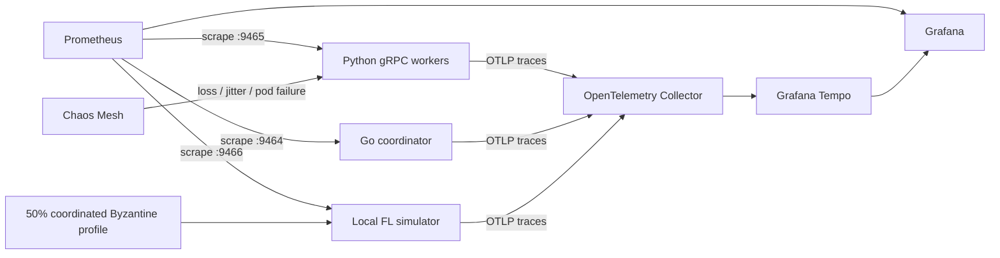

# Resilience and Observability Stack

This document describes the failure-injection and telemetry layer used to stress and observe ZeroTrust-FL-Sim. It complements, rather than changes, the security assumptions in the zero-trust transport, privacy, and Byzantine-robust aggregation layers.

## Architecture



The Go coordinator remains the authenticated network/control plane. It does not perform the native FL aggregation. Aggregator time, CPU/GPU memory overhead, churn, and poisoning-mitigation metrics therefore come from the telemetry-enabled local simulator. Worker epoch and client-observed network metrics come from Python gRPC workers. Coordinator gRPC server metrics come from Go.

## Chaos Mesh interface

The repository provides Kubernetes Chaos Mesh manifests in `deploy/chaos/chaos-mesh/`.

### 50% packet loss

`network-loss-50.yaml` applies bidirectional 50% packet loss to worker pods for 60 seconds.

Under an idealized independent-loss model with loss probability `p=0.5`, the probability that at least one of `k` attempts is delivered is:

```math
P_{delivery}(k)=1-p^k.
```

For three independent attempts:

```math
P_{delivery}(3)=1-0.5^3=0.875.
```

This is only a calculation aid. Real TCP/gRPC behavior includes congestion control, retransmission timers, HTTP/2 flow control, deadlines, and correlated loss. The Chaos Mesh manifest also configures 25% loss correlation, so the independent model is not an exact prediction of observed delivery.

### Network jitter

`network-jitter.yaml` configures:

```text
base latency = 150 ms
jitter       = 100 ms
correlation  = 50%
duration     = 60 s
```

The observed RPC distribution should be measured from `ztfl_network_latency_seconds` rather than inferred from the configured jitter parameter.

### Random node churn

`node-churn.yaml` uses `PodChaos` with `pod-failure` and `random-max-percent: 50`, temporarily failing a random subset of worker pods for 30 seconds.

The simulator/dashboard churn metric is:

```math
C_t=\frac{F_t+S_t}{N_t},
```

where `F_t` is failed clients, `S_t` is stragglers, and `N_t` is selected clients in round `t`.

## Extreme Byzantine collusion

The `collusion` poisoning mode uses a shared deterministic round direction. For dimension `d`, shared sign vector `s_t in {-1,+1}^d`, local update `g_i`, and collusion scale `gamma`:

```math
\widetilde{g}_i^{(t)}
=\gamma\lVert g_i^{(t)}\rVert_2
\frac{s_t}{\sqrt{d}}.
```

All malicious clients with the same `collusion_seed` use the same `s_t` in round `t`, while the magnitude remains proportional to each local update norm.

A 50% Byzantine profile is intentionally outside Krum's classical fault requirement. With `f=n/2`:

```math
n\ge2f+3
\Rightarrow
n\ge2(n/2)+3
\Rightarrow
n\ge n+3,
```

which is impossible. Therefore the 50% collusion profile is an extreme failure-mode experiment, not a regime in which Krum is claimed to provide a guarantee.

## Poisoning mitigation telemetry

For attacked rounds, the simulator compares the robust aggregate against the benign-only mean and the naive all-client mean.

Let:

```math
e_{robust}=\lVert g_{robust}-g_{benign}\rVert_2,
```

```math
e_{naive}=\lVert g_{mean}-g_{benign}\rVert_2.
```

The score exported by the existing simulator logic is:

```math
M_t=\operatorname{clip}\left(1-\frac{e_{robust}}{e_{naive}},0,1\right).
```

The attack is considered mitigated when:

```math
e_{robust}<e_{naive}.
```

The running mitigation rate is:

```math
R_{mitigation}
=\frac{\#\{t:\text{attacked and mitigated}\}}
{\#\{t:\text{attacked}\}}.
```

This is an empirical robustness metric, not a formal security proof.

## OpenTelemetry tracing

### Go coordinator

The coordinator uses OpenTelemetry gRPC server stats instrumentation so trace context arriving over gRPC is extracted and server spans are created. OTLP/gRPC export is enabled when `ZTFL_OTEL_ENDPOINT` is non-empty.

Relevant environment variables:

```text
ZTFL_OTEL_ENDPOINT=otel-collector:4317
ZTFL_OTEL_INSECURE=true
ZTFL_TELEMETRY_INSTANCE=coordinator
ZTFL_METRICS_ADDRESS=0.0.0.0:9464
```

### Python worker

The long-lived worker instruments its gRPC client before the channel is created. A parent `fl.worker.cycle` span contains client gRPC spans for registration, model retrieval, update submission, and heartbeat.

```text
ZTFL_TELEMETRY_ENABLED=true
ZTFL_OTEL_ENDPOINT=otel-collector:4317
ZTFL_OTEL_INSECURE=true
ZTFL_METRICS_PORT=9465
```

Python gRPC auto-instrumentation currently comes from the OpenTelemetry instrumentation package's beta release line. The tracing layer is therefore optional and does not participate in authorization or cryptographic decisions.

## Prometheus metrics

| Metric | Producer | Meaning |
| --- | --- | --- |
| `ztfl_epoch_duration_seconds` | Python worker | local training/update duration |
| `ztfl_network_latency_seconds` | Python worker | client-observed gRPC RTT by RPC |
| `ztfl_grpc_server_latency_seconds` | Go coordinator | server-side gRPC latency by method/code |
| `ztfl_aggregation_duration_seconds` | simulator | aggregation runtime by backend/method |
| `ztfl_aggregator_cpu_memory_overhead_bytes` | simulator | non-negative RSS delta around aggregation |
| `ztfl_aggregator_gpu_memory_overhead_bytes` | simulator | CUDA peak allocation above pre-aggregation baseline |
| `ztfl_process_resident_memory_bytes` | worker/simulator | current RSS |
| `ztfl_gpu_memory_bytes` | worker/simulator | current PyTorch CUDA allocation |
| `ztfl_node_churn_rate` | simulator | failed+straggler fraction for latest round |
| `ztfl_poisoning_mitigation_score` | simulator | latest robust-vs-naive score |
| `ztfl_poisoning_mitigation_rate` | simulator | running attacked-round mitigation rate |
| `ztfl_updates_total` | Python worker | accepted/rejected update submissions |

### Memory measurement boundary

CPU aggregation memory overhead is currently an RSS before/after delta:

```math
\Delta M_{CPU}=\max(0,RSS_{after}-RSS_{before}).
```

It is not a sampled peak-RSS profiler. Short-lived allocations that are freed before the `after` sample may not be reflected.

For CUDA, the simulator resets PyTorch peak statistics before aggregation and reports:

```math
\Delta M_{GPU}=\max(0,M_{peak}-M_{before}).
```

This measures PyTorch allocator activity visible to the process. Driver/runtime allocations outside that allocator require separate GPU tooling for complete accounting.

## Grafana stack

The opt-in Docker overlay provisions:

- OpenTelemetry Collector `0.159.0`;
- Grafana Tempo `3.0.3`;
- Prometheus `3.14.0`;
- Grafana `13.2.0`;
- `observability/grafana/dashboards/dashboard.json`.

Start it with:

```bash
docker compose \
  -f docker-compose.yml \
  -f docker-compose.observability.yml \
  up -d --build
```

Default local endpoints:

```text
Grafana       http://localhost:3000
Prometheus    http://localhost:9090
Tempo API     http://localhost:3200
OTLP/gRPC     localhost:4317
OTLP/HTTP     localhost:4318
```

The overlay also starts a synthetic telemetry simulator with a 50% coordinated collusion profile so aggregation-memory and mitigation panels have a real metric source. The secure gRPC coordinator and long-lived workers continue to run as a separate control-plane workload.

Stop and remove observability data volumes with:

```bash
docker compose \
  -f docker-compose.yml \
  -f docker-compose.observability.yml \
  down -v --remove-orphans
```

## Kubernetes chaos run

After installing Chaos Mesh and labeling worker pods with `app.kubernetes.io/component=worker`:

```bash
kubectl apply -f deploy/chaos/chaos-mesh/network-loss-50.yaml
kubectl apply -f deploy/chaos/chaos-mesh/network-jitter.yaml
kubectl apply -f deploy/chaos/chaos-mesh/node-churn.yaml
```

Run one fault at a time first. Combining all profiles creates a compound experiment whose result cannot be attributed to a single fault source.

## Security and interpretation notes

- OTLP plaintext mode is intended for the isolated local observability network. Use TLS/authentication for remote collectors.
- Prometheus/Grafana endpoints expose operational metadata and should not be published to untrusted networks without access controls.
- Chaos selectors must be reviewed before use. The shipped manifests are scoped to namespace `zerotrust-fl` and worker labels.
- A 50% Byzantine population deliberately violates standard Krum assumptions.
- Telemetry should not be used as evidence of a guarantee beyond the threat-model assumptions documented elsewhere in the repository.
